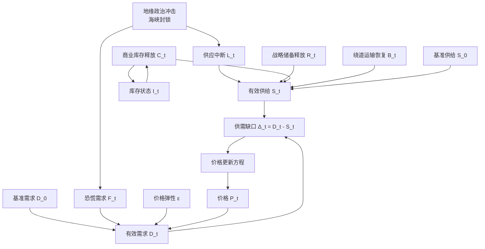

# Findings

## 2026-06-06

### 步骤1：短期模型必须包含的6个机制

根据题面“任务1：短期冲击模型（0-90天）”的明确要求，短期模型至少应包含以下 6 个核心机制：

1. **供应中断机制**
   - 含义：霍尔木兹海峡封锁后，原本经该海峡运输的原油无法正常外运，导致全球市场出现大规模供给损失。
   - 题面依据：海峡原油通行量由 2000 万桶/日近似降至 0，实际供应中断量估算为 1400-1800 万桶/日。
   - 建模作用：这是油价短期上升的主冲击源。

2. **战略储备释放机制**
   - 含义：各国政府动用战略石油储备，对冲部分供给缺口。
   - 题面依据：释放能力上限约 200-700 万桶/日，且存在启动延迟。
   - 建模作用：削弱早期供给冲击，降低价格峰值。

3. **商业库存缓冲机制**
   - 含义：企业和贸易商利用现有商业库存平滑短期供应不足。
   - 题面依据：初始商业库存约 5.8 亿桶，可作为缓冲。
   - 建模作用：在冲突初期提供“临时供给补偿”，防止价格瞬间失控。

4. **绕道运输恢复机制**
   - 含义：部分海湾国家通过替代港口、管道和绕行路线逐步恢复部分出口能力。
   - 题面依据：最大能力 300 万桶/日，启动时间 7-30 天。
   - 建模作用：这是中前期价格由“急涨”转向“高位回落”的关键缓冲项。

5. **恐慌性需求机制**
   - 含义：战争和封锁预期引发市场抢购、囤积和投机性放大，使短期有效需求高于正常水平。
   - 题面依据：需求放大系数 1.1-1.2 倍，持续 1-2 周。
   - 建模作用：解释事件初期价格超调和快速冲高。

6. **需求价格弹性机制**
   - 含义：价格大幅上涨后，终端消费、炼厂采购和部分工业需求开始收缩，形成反向抑制。
   - 题面依据：短期需求价格弹性约为 -0.05。
   - 建模作用：解释价格为何在高位后逐步回落，而不是无限上升。

### 当前判断

这 6 个机制已经覆盖了题面要求的短期供需冲击主线：

- 供应中断和恐慌需求负责“推高价格”；
- 战略储备、商业库存、绕道运输负责“缓冲冲击”；
- 需求价格弹性负责“高价反馈抑制”。

因此，后续短期模型可以围绕“**冲击项 + 缓冲项 + 反馈项**”三层结构展开。

### 步骤2：明确各机制的变量类型

为了后续建立动态方程，需要先区分哪些量是“系统状态”、哪些量是“外部给定路径”、哪些量是“由规则决定的调节量”。这里采用以下划分：

- **状态变量**：会随着时间递推更新，并且其当前值会影响下一时刻系统状态；
- **控制变量**：由政策、市场调节或人为设定规则决定，通常带有上限、时滞或约束；
- **外生变量**：由题目背景或外部冲击给定，不由模型内部内生决定。

各机制对应分类如下：

1. **供应中断机制 \(L_t\)**：外生变量
   - 理由：短期内海峡是否封锁、封锁强度多大，主要由战争与地缘政治决定，不由油价模型内部反推出来。
   - 在模型中的处理：通常作为给定冲击路径输入，例如设为高位常数、分段常数或随时间略有缓和的外生函数。

2. **战略储备释放机制 \(R_t\)**：控制变量
   - 理由：战略储备释放本质上是政府或国际协调下的政策响应，不是市场自动生成的。
   - 在模型中的处理：由“启动延迟 + 单日释放上限 + 持续期”共同约束。

3. **商业库存缓冲机制 \(C_t\)**：控制变量
   - 理由：商业库存释放速度并非完全固定，而是企业、贸易商和炼厂在高价与短缺环境下的调节行为。
   - 在模型中的处理：释放量 \(C_t\) 是控制变量，但它依赖剩余库存状态 \(I_t\)。

4. **绕道运输恢复机制 \(B_t\)**：控制变量
   - 理由：绕道运输受到运输组织、港口条件、管道能力和时间延迟约束，属于“可调但受限”的恢复手段。
   - 在模型中的处理：通常设为延迟启动并逐步爬坡到上限的受控恢复项。

5. **恐慌性需求机制 \(F_t\)**：外生变量
   - 理由：恐慌情绪源于战争预期、市场叙事和心理冲击，短期内更适合作为外部扰动而非内生变量。
   - 在模型中的处理：可设为前高后低的时变放大系数，例如前 7-14 天显著、之后指数衰减。

6. **需求价格弹性机制 \(\varepsilon\)**：外生参数
   - 理由：题面已直接给出短期弹性约为 -0.05，它更像一个结构参数，而不是随时间递推的状态。
   - 在模型中的处理：作为需求函数中的固定参数，用来刻画价格上升后的需求抑制效应。

### 由机制进一步抽象出的核心状态量

虽然上面 6 个机制里大多数表现为外生变量或控制变量，但完整短期模型至少还需要两个真正递推的状态变量：

1. **价格 \(P_t\)**：状态变量
   - 理由：价格会通过更新方程逐日演化，并反过来影响需求。

2. **剩余商业库存 \(I_t\)**：状态变量
   - 理由：库存会随着每日释放而减少，后续可释放空间取决于当前剩余库存。

因此，短期模型的变量分层可以写成：

- **状态变量**：\(P_t\)、\(I_t\)
- **控制变量**：\(R_t\)、\(C_t\)、\(B_t\)
- **外生变量/参数**：\(L_t\)、\(F_t\)、\(\varepsilon\)

### 当前判断

这样的分类有两个好处：

1. 后续建模时，动态递推只需要重点更新 \(P_t\) 和 \(I_t\)，模型结构会比较清晰；
2. 其余机制可以作为“输入路径”或“受约束响应项”嵌入，方便做情景分析和敏感性分析。

### 步骤3：统一变量单位和记号

为了避免后续公式出现量纲混乱，需要先统一所有变量的单位、时间尺度和记号规则。

### 1. 时间尺度统一

短期模型研究区间为冲突后的 **0-90 天**，因此统一采用：

- 时间变量：\(t = 0,1,2,\dots,90\)
- 时间单位：**天**
- 含义：
  - \(t=0\)：2026 年 2 月 28 日，冲突爆发日
  - \(t=1\)：冲突后第 1 天
  - 以此类推

说明：

- 模型内部可以按“自然日”定义；
- 与附件价格数据校准时，优先只在交易日上比较模型值与实际值。

### 2. 供需流量单位统一

所有“每天发生多少原油流动”的变量统一采用：

- 单位：**万桶/日**

这样做的原因是题面中的关键数据几乎都以“万桶/日”给出，直接使用最方便。

统一后主要变量为：

- \(S_0\)：基准供给，单位万桶/日
- \(D_0\)：基准需求，单位万桶/日
- \(L_t\)：供应中断量，单位万桶/日
- \(R_t\)：战略储备释放量，单位万桶/日
- \(C_t\)：商业库存释放量，单位万桶/日
- \(B_t\)：绕道运输恢复量，单位万桶/日
- \(S_t\)：第 \(t\) 天有效供给，单位万桶/日
- \(D_t\)：第 \(t\) 天有效需求，单位万桶/日

### 3. 库存单位统一

库存是“存量”，不应与“流量”混用，因此统一采用：

- 单位：**万桶**

对应变量：

- \(I_t\)：第 \(t\) 天末剩余商业库存，单位万桶

题面给定商业库存初值 5.8 亿桶，因此换算为：

\[
I_0 = 58000 \text{ 万桶}
\]

若后续需要加入战略储备总量，也建议同样统一为“万桶”。

### 4. 价格单位统一

价格变量统一采用：

- 单位：**美元/桶**

对应变量：

- \(P_t\)：第 \(t\) 天布伦特原油价格，单位美元/桶
- \(P_0\)：基准价格，单位美元/桶

后续附件数据中的 `close`、`open`、`high`、`low` 都按该单位使用。

### 5. 比例型变量统一

所有“系数、比例、弹性、放大倍数”统一视为无量纲变量。

包括：

- \(F_t\)：恐慌性需求放大项，若写成附加比例，则无量纲
- \(\varepsilon\)：需求价格弹性，无量纲
- \(\beta\)、\(\beta_1\)、\(\beta_2\)、\(\beta_3\)：价格调整系数，具体量纲取决于价格方程写法

这里要特别注意：

1. 如果价格方程采用

\[
P_{t+1}=P_t+\beta(D_t-S_t)
\]

则 \(\beta\) 需要带量纲，单位应为：

\[
\text{美元} \cdot \text{日} / (\text{桶} \cdot \text{万})
\]

这种写法解释上不够自然。

2. 如果价格方程采用归一化形式

\[
P_{t+1}=P_t+\beta_1\frac{D_t-S_t}{S_0}P_t
\]

则 \(\beta_1\) 可视为无量纲参数，更适合后续解释与拟合。

因此，当前更推荐后续使用 **归一化价格更新公式**。

### 6. 建议统一符号表

为保证论文书写一致，建议固定使用下表中的记号：

| 符号 | 含义 | 单位 |
|---|---|---|
| \(t\) | 冲突后第 \(t\) 天 | 天 |
| \(P_t\) | 第 \(t\) 天油价 | 美元/桶 |
| \(P_0\) | 基准日油价 | 美元/桶 |
| \(S_0\) | 战前基准供给 | 万桶/日 |
| \(D_0\) | 战前基准需求 | 万桶/日 |
| \(L_t\) | 供应中断量 | 万桶/日 |
| \(R_t\) | 战略储备释放量 | 万桶/日 |
| \(C_t\) | 商业库存释放量 | 万桶/日 |
| \(B_t\) | 绕道运输恢复量 | 万桶/日 |
| \(S_t\) | 有效供给 | 万桶/日 |
| \(D_t\) | 有效需求 | 万桶/日 |
| \(I_t\) | 剩余商业库存 | 万桶 |
| \(F_t\) | 恐慌需求扰动项 | 无量纲 |
| \(\varepsilon\) | 需求价格弹性 | 无量纲 |
| \(\beta_1,\beta_2,\beta_3\) | 价格调整参数 | 无量纲或待定 |

### 当前判断

完成这一步后，后续建模可以遵守以下统一口径：

- 时间按“天”
- 供需按“万桶/日”
- 库存按“万桶”
- 价格按“美元/桶”
- 比例和弹性按“无量纲”

这样后面写供需方程、库存递推式、价格更新式时，量纲会保持一致，便于检查模型是否合理。

### 步骤4：整理变量关系图与模型结构草图

在前 3 步基础上，短期冲击模型的结构已经可以画出来。这里先给出一个便于后续写论文和搭公式的结构草图。

### 1. 变量关系图

### 2. 结构含义说明

这张图表达的是一个很典型的“冲击 - 缓冲 - 反馈”闭环：

1. **外部冲击层**
   - 地缘政治冲突触发海峡封锁；
   - 封锁直接带来供应中断 \(L_t\)；
   - 同时引发恐慌性需求 \(F_t\)。

2. **供给调节层**
   - 基准供给 \(S_0\) 被供应中断削弱；
   - 战略储备释放 \(R_t\)、商业库存释放 \(C_t\)、绕道运输恢复 \(B_t\) 共同对冲供给缺口；
   - 最终形成第 \(t\) 天的有效供给 \(S_t\)。

3. **需求演化层**
   - 基准需求 \(D_0\) 在恐慌需求扰动下被放大；
   - 同时价格 \(P_t\) 通过需求价格弹性 \(\varepsilon\) 反向压制需求；
   - 最终形成第 \(t\) 天的有效需求 \(D_t\)。

4. **价格形成层**
   - 有效需求 \(D_t\) 与有效供给 \(S_t\) 的差额形成供需缺口；
   - 供需缺口通过价格更新方程推动价格 \(P_t\) 变化。

5. **库存反馈层**
   - 商业库存释放 \(C_t\) 会消耗库存存量 \(I_t\)；
   - 剩余库存 \(I_t\) 又反过来约束下一期 \(C_t\) 的释放能力；
   - 因此库存是模型中最重要的状态变量之一。

### 3. 模型结构草图

基于上面的关系图，短期模型可以整理成 4 个模块：

#### 模块A：外生冲击模块

负责给定战争冲击路径，包括：

- \(L_t\)：供应中断路径
- \(F_t\)：恐慌需求路径

这一部分通常由题目条件和情景设定直接给出。

#### 模块B：供给恢复模块

负责计算有效供给：

\[
S_t = S_0 - L_t + R_t + C_t + B_t
\]

其中：

- \(R_t\) 反映政策性储备释放；
- \(C_t\) 反映商业库存缓冲；
- \(B_t\) 反映运输恢复能力。

#### 模块C：需求响应模块

负责计算有效需求：

\[
D_t = D_0 \cdot (1+F_t)\cdot \left(\frac{P_t}{P_0}\right)^{\varepsilon}
\]

这一模块将“恐慌放大效应”和“高价抑制效应”合并到需求函数中。

#### 模块D：状态更新模块

负责让模型逐日递推：

1. 价格更新：

\[
P_{t+1} = f(P_t, D_t-S_t)
\]

2. 库存更新：

\[
I_{t+1} = I_t - C_t
\]

其中库存更新式后续还可以加上非负约束：

\[
I_{t+1} = \max(I_t - C_t, 0)
\]

### 4. 当前推荐的建模顺序

根据这张结构图，后续正式建模时建议按照下面顺序推进：

1. 先设定外生冲击路径 \(L_t\)、\(F_t\)；
2. 再写供给恢复项 \(R_t\)、\(C_t\)、\(B_t\)；
3. 接着写需求响应函数 \(D_t\)；
4. 最后写价格递推和库存递推。

这样做的好处是：

- 结构清楚；
- 每个模块都能单独解释；
- 后面参数校准和情景分析也更方便拆开做。

### 当前判断

至此，阶段1已经形成了完整的建模准备框架：

- 已明确必须包含的机制；
- 已明确变量类型；
- 已统一单位与符号；
- 已得到可直接用于论文的结构图和模块草图。

这意味着下一步可以进入 **阶段2：价格数据清洗与事件窗截取**，开始真正接触附件数据。

### 步骤5：读取并清洗附件价格数据

本步骤只处理附件数据本身，不做事件窗截取。

### 1. 原始数据结构

附件文件为：

- [附件1.布伦特原油期货主力合约价格数据.csv](<D:\codespace\mathematical-modeling\附件1.布伦特原油期货主力合约价格数据.csv>)

字段包括：

- `time`
- `thscode`
- `preClose`
- `open`
- `high`
- `low`
- `close`

这是一份标准的布伦特原油期货主力合约日线价格数据。

### 2. 数据质量检查结果

对原始 CSV 的初步检查结果如下：

- 总行数：2256
- 起始日期：2017/9/1
- 截止日期：2026/6/1
- `time` 列无缺失
- `close` 列无缺失
- 日期无重复
- `preClose` 列首行存在 `NA`，属于首条记录常见现象，不影响后续使用收盘价建模

### 3. 清洗规则

为了后续阶段统一使用，采用以下清洗规则：

1. 保留字段：
   - `date`
   - `thscode`
   - `pre_close`
   - `open`
   - `high`
   - `low`
   - `close`

2. 日期格式统一为：
   - `YYYY-MM-DD`

3. 数值字段统一转为数值型：
   - `preClose` 中的 `NA` 转为空值
   - 其余价格字段全部转为数值

4. 输出一份标准化清洗文件，供下一步事件窗口截取直接使用。

### 4. 清洗结果

已生成标准化数据文件：

- [brent_prices_cleaned.csv](<D:\codespace\mathematical-modeling\brent_prices_cleaned.csv>)

该文件的特点：

- 日期字段已统一为 `YYYY-MM-DD`
- `pre_close` 首行空值已保留为空
- 价格列已统一为可直接分析的数值格式
- 可以直接用于下一步筛选 2026 年事件窗口

### 当前判断

原始附件质量整体较好，足以直接用于建模。后续真正需要注意的是：

- 交易日序列并不覆盖自然日；
- 模型内部按日递推时，需要说明“非交易日如何与观测价格对齐”。

### 步骤6：截取 2026 年事件窗口

本步骤根据 `planning.md` 中的约定，截取“战前基准日 + 冲突后的观测窗口”。

### 1. 事件窗口口径

当前采用的事件窗口为：

- 起点：`2026-02-27`
- 终点：`2026-06-01`

这样设置的原因是：

1. `2026-02-27` 是冲突爆发前最后一个交易日，可作为基准价格日；
2. `2026-02-28` 为题面设定的冲突爆发日；
3. 附件数据当前最晚到 `2026-06-01`，因此暂以此作为观测末端。

### 2. 截取结果

已生成事件窗口数据文件：

- [brent_event_window.csv](<D:\codespace\mathematical-modeling\brent_event_window.csv>)

窗口数据基本情况：

- 交易日条数：66
- 首行日期：`2026-02-27`
- 首日收盘价：`73.21`
- 末行日期：`2026-06-01`
- 末日收盘价：`95.25`

### 3. 当前观察

从截取后的前几条记录可以直接看出，冲突发生后价格存在明显的短期快速上冲：

- `2026-02-27` 收盘价为 `73.21`
- `2026-03-02` 收盘价升至 `78.07`
- `2026-03-06` 收盘价已到 `93.32`

说明事件冲击对价格的影响在交易层面几乎是即时体现的，这与后续短期冲击模型的设定是相符的。

### 当前判断

事件窗口已经单独提取完成，下一步就可以在该窗口上继续做：

1. 关键节点标记；
2. 峰值识别；
3. 回落区间识别；
4. 收益率与波动率等统计量计算。

### 步骤7：标记事件窗口关键节点

本步骤在 [brent_event_window.csv](<D:\codespace\mathematical-modeling\brent_event_window.csv>) 上识别短期冲击模型最重要的几个观测节点。

### 1. 基准日

- 日期：`2026-02-27`
- 收盘价：`73.21` 美元/桶

该日作为冲突爆发前最后一个交易日，可作为模型中的基准价格 \(P_0\)。

### 2. 首次显著跳涨

这里将“首次显著跳涨”定义为：**事件窗口内第一个收盘价相较基准日上涨超过 5% 的交易日**。

识别结果：

- 日期：`2026-03-02`
- 收盘价：`78.07` 美元/桶
- 相较基准日涨幅：`6.64%`

说明：

- 冲突爆发后的第一个交易日就出现了明显跳涨；
- 这说明价格对战争冲击的反应几乎是即时的；
- 在模型中，恐慌需求项和供应中断项都应在早期迅速起效，而不是缓慢释放。

### 3. 峰值日识别

按事件窗口内的**最高收盘价**识别峰值日，结果为：

- 日期：`2026-05-04`
- 收盘价：`114.06` 美元/桶

进一步观察峰值附近价格：

- `2026-04-29`：`112.49`
- `2026-04-30`：`110.86`
- `2026-05-01`：`109.20`
- `2026-05-04`：`114.06`
- `2026-05-05`：`110.31`
- `2026-05-06`：`101.96`

由此可见：

- 峰值并非单日孤立点，而是出现在 4 月底到 5 月初的一段高位平台中；
- 这与题目中“4 月底价格冲到 126 美元附近，随后有所回落”的叙述方向一致；
- 因此模型中应允许“高位平台 + 随后回落”的路径，而不是只拟合尖峰型冲击。

### 4. 5月下旬回落区间

将 `2026-05-20` 至 `2026-05-31` 作为“5 月下旬回落观察区间”，统计结果为：

- 样本交易日数：`8`
- 最低收盘价：`91.89`
- 最高收盘价：`105.16`
- 平均收盘价：`97.68`

该区间主要收盘价如下：

- `2026-05-20`：`105.16`
- `2026-05-21`：`104.92`
- `2026-05-22`：`104.25`
- `2026-05-25`：`93.64`
- `2026-05-26`：`96.28`
- `2026-05-27`：`92.88`
- `2026-05-28`：`92.40`
- `2026-05-29`：`91.89`

可见：

- 5 月下旬价格已经明显从峰值区间回落；
- 回落后价格大致稳定在 `92-105` 美元/桶之间；
- 这与题目给出的“90-110 美元区间持续震荡”高度一致。

### 5. 对后续建模的直接启示

这一组关键节点对模型形式有直接约束：

1. **早期冲击要足够快**
   - 因为第一个交易日就已经出现显著跳涨。

2. **中期要允许高位平台**
   - 因为峰值附近不是单点，而是连续多日高位波动。

3. **后期必须存在回落机制**
   - 因为 5 月下旬已经回落到 90 多美元区间。

因此，后续模型至少要能同时解释：

- “快速上冲”
- “高位维持”
- “随后回落但不跌回战前”

### 当前判断

关键节点已经识别完成。下一步最自然的工作是继续做事件窗口的统计特征提取，包括：

1. 日收益率；
2. 峰值涨幅；
3. 滚动波动率；
4. 用这些统计量为后续参数校准提供目标特征。

### 步骤8：计算事件窗口统计特征

本步骤基于 [brent_event_window.csv](<D:\codespace\mathematical-modeling\brent_event_window.csv>) 计算后续建模会直接用到的统计特征，并生成统计结果文件：

- [brent_event_stats.csv](<D:\codespace\mathematical-modeling\brent_event_stats.csv>)

该文件包含以下字段：

- `date`
- `close`
- `simple_return`：简单日收益率
- `log_return`：对数日收益率
- `rolling_vol_5d`：5日滚动波动率（基于对数收益率）

### 1. 峰值涨幅

以基准日 `2026-02-27` 的收盘价 `73.21` 为基准，窗口内最高收盘价为：

- 峰值日：`2026-05-04`
- 峰值价格：`114.06`

对应峰值涨幅为：

\[
\frac{114.06 - 73.21}{73.21} \approx 55.80\%
\]

这说明短期冲击模型至少要能再现一个 **约 56% 的累计峰值涨幅**。

### 2. 日收益率特征

事件窗口的日收益率统计结果显示：

- 平均日收益率：`0.50%`
- 最大单日上涨：`11.90%`
  - 发生日期：`2026-03-12`
- 最大单日下跌：`-10.18%`
  - 发生日期：`2026-05-25`

这表明：

1. 冲突期间价格不是平滑上升，而是伴随着显著跳跃；
2. 模型不能只拟合趋势，还要尽量解释“冲高”和“快速回落”；
3. 后续若模型过于平滑，说明恐慌项或缓冲项的时间设定可能不合理。

### 3. 波动率特征

以 5 日滚动窗口计算对数收益率波动率，得到：

- 平均 5 日滚动波动率：`0.0388`
- 最大 5 日滚动波动率：`0.0595`

说明事件窗口中存在显著的短期高波动阶段，尤其在价格快速冲击与回落附近更明显。

### 4. 对后续参数校准的意义

这些统计量可以直接作为后续模型校准的目标特征：

1. **峰值涨幅约 55.80%**
   - 用于约束模型不能低估冲击强度。

2. **首次跳涨快、最大单日涨幅接近 12%**
   - 用于约束恐慌需求项和供给中断项的前期强度。

3. **5 月下旬存在明显回落**
   - 用于约束库存、储备和绕道运输等缓冲机制不能设得太弱。

4. **存在高波动阶段**
   - 用于判断模型路径是否过于平滑，必要时可加入更强的时变冲击项。

### 当前判断

到这里，第二阶段所需的核心观测特征已经基本齐全：

- 已有清洗后的价格数据；
- 已有事件窗口；
- 已识别关键节点；
- 已得到收益率、峰值涨幅和波动率特征。

这意味着下一步已经可以进入 **阶段3：建立供需缺口动态方程**。

### 步骤9：写出最简版供需缺口动态方程

本步骤先不给每个机制加入复杂的时滞、上限和分段函数，而是先写出一个能直接进入校准流程的**最简骨架模型**。目标是让模型至少具备以下能力：

1. 能表达“供给减少会推升价格”；
2. 能表达“恐慌需求会放大价格上冲”；
3. 能表达“库存、储备和绕道运输会缓冲冲击”；
4. 能表达“价格上涨后需求会被抑制”。

### 1. 最简版供给方程

定义第 \(t\) 天的有效供给为：

\[
S_t = S_0 - L_t + R_t + C_t + B_t
\]

其中：

- \(S_0\)：战前基准供给，单位万桶/日；
- \(L_t\)：供应中断量；
- \(R_t\)：战略储备释放量；
- \(C_t\)：商业库存释放量；
- \(B_t\)：绕道运输恢复量。

这条方程的含义非常直接：

- 供应中断 \(L_t\) 会减少市场可获得供给；
- 战略储备、商业库存和绕道运输共同对冲缺口。

### 2. 最简版需求方程

定义第 \(t\) 天的有效需求为：

\[
D_t = D_0 \cdot (1+F_t)\cdot \left(\frac{P_t}{P_0}\right)^{\varepsilon}
\]

其中：

- \(D_0\)：战前基准需求，单位万桶/日；
- \(F_t\)：恐慌性需求扰动项；
- \(P_t\)：第 \(t\) 天价格；
- \(P_0\)：基准价格；
- \(\varepsilon=-0.05\)：短期需求价格弹性。

这条方程同时包含两个方向相反的作用：

1. **恐慌需求项** \(1+F_t\) 会把需求向上推；
2. **价格弹性项** \(\left(\frac{P_t}{P_0}\right)^{\varepsilon}\) 会在价格升高后压低需求。

因此它天然适合解释“先冲高、后缓和”的短期路径。

### 3. 最简版供需缺口定义

定义第 \(t\) 天的供需缺口为：

\[
\Delta_t = D_t - S_t
\]

为便于价格更新和参数解释，进一步做归一化处理：

\[
g_t = \frac{\Delta_t}{S_0} = \frac{D_t-S_t}{S_0}
\]

其中：

- \(g_t>0\)：需求大于供给，价格有上升压力；
- \(g_t<0\)：供给大于需求，价格有下降压力；
- \(g_t=0\)：供需平衡。

归一化之后，\(g_t\) 是无量纲量，后面价格调整参数更容易解释。

### 4. 最简版价格更新方程

当前推荐采用归一化后的乘法更新形式：

\[
P_{t+1} = P_t \left(1 + \beta g_t\right)
\]

其中：

- \(\beta > 0\) 为价格调整强度参数。

这个形式的优点：

1. 参数 \(\beta\) 的经济含义清楚：
   - 供需缺口越大，价格变化越快。
2. 与原题给出的

\[
P_{t+1}=P_t+\beta(D_t-S_t)
\]

相比，它避免了量纲不自然的问题。

3. 更适合后续与真实价格涨幅对齐：
   - 因为它本质上描述的是“相对缺口驱动相对价格变化”。

### 5. 最简版库存递推方程

由于商业库存是状态变量，最简模型中还应保留库存递推：

\[
I_{t+1} = I_t - C_t
\]

并加上非负约束：

\[
I_{t+1} = \max(I_t - C_t, 0)
\]

这条方程的意义是：

- 商业库存释放不是无限的；
- 随着库存被消耗，后续缓冲能力会逐渐下降；
- 这也是价格无法长期被库存压住的重要原因。

### 6. 最简版方程组汇总

因此，当前最简版短期冲击模型可写成：

\[
\begin{cases}
S_t = S_0 - L_t + R_t + C_t + B_t \\
D_t = D_0 (1+F_t)\left(\dfrac{P_t}{P_0}\right)^{\varepsilon} \\
g_t = \dfrac{D_t - S_t}{S_0} \\
P_{t+1} = P_t(1+\beta g_t) \\
I_{t+1} = \max(I_t - C_t,0)
\end{cases}
\]

这是后续全部细化模型的母框架。

### 7. 这一版模型的适用范围

这还是一个“骨架版”模型，它目前：

- **已经能做的事**
  - 描述供需冲击与价格联动；
  - 体现库存缓冲和价格弹性反馈；
  - 作为后续参数校准的基础结构。

- **还没展开的细节**
  - \(L_t\) 的具体路径；
  - \(R_t\) 的启动时滞与释放上限；
  - \(C_t\) 的释放规则；
  - \(B_t\) 的爬坡过程；
  - \(F_t\) 的持续时间与衰减方式。

这些都属于下一步要继续补进去的内容。

### 8. 对后续建模的直接启示

从当前方程组出发，后面细化模型时最自然的顺序是：

1. 先设定 \(L_t\) 的基础冲击路径；
2. 再写 \(R_t\)、\(C_t\)、\(B_t\) 的受约束响应函数；
3. 再写 \(F_t\) 的短期衰减函数；
4. 最后再用真实价格数据去校准 \(\beta\) 和其他待定参数。

### 当前判断

最简版供需缺口动态方程已经形成，并且它已经满足后续建模最需要的两点：

1. 结构上能解释“上冲 - 维持 - 回落”；
2. 形式上能直接进入下一步的机制函数细化与参数校准。

### 步骤10：细化各机制子函数的具体形式

本步骤的目标是：在最简骨架模型基础上，给每一个机制配上一条**可计算、可解释、可调参**的时间路径函数。

为了兼顾论文表达与后续拟合，当前优先采用 **分段函数 + 简单爬坡/衰减函数** 的形式。

---

### 1. 供应中断函数 \(L_t\)

题面给出的中断量区间为 `1400-1800` 万桶/日，因此先采用“高位冲击 + 小幅缓和”的分段形式：

\[
L_t=
\begin{cases}
L_0, & 0\le t < T_L \\
L_0-\delta_L, & t\ge T_L
\end{cases}
\]

其中：

- \(L_0\in[1400,1800]\)
- \(T_L\) 表示封锁高强度维持时长
- \(\delta_L\ge 0\) 表示后期因局部适应、灰色运输或有限恢复而减少的中断量

当前推荐的基准设定是：

- \(L_0 = 1600\)
- \(T_L = 30\)
- \(\delta_L = 100\sim 200\)

解释：

- 这能体现“冲击一开始非常强”；
- 也允许中期出现轻微缓和，但不至于让供给缺口快速消失。

---

### 2. 战略储备释放函数 \(R_t\)

题面强调“有启动延迟”和“释放上限”，因此适合用“延迟后恒定释放”的简化形式：

\[
R_t=
\begin{cases}
0, & 0\le t < \tau_R \\
R_{\max}, & t\ge \tau_R
\end{cases}
\]

其中：

- \(\tau_R\)：战略储备启动延迟
- \(R_{\max}\in[200,700]\)：单日释放上限

当前推荐的基准设定是：

- \(\tau_R = 7\)
- \(R_{\max} = 450\)

解释：

- 政策反应通常不是当天就到位；
- 一旦协调机制形成，短期内可近似看作稳定释放。

如果后面需要更平滑，可替换为：

\[
R_t = R_{\max}\left(1-e^{-k_R(t-\tau_R)}\right),\quad t\ge \tau_R
\]

但第一版不必这么复杂。

---

### 3. 商业库存释放函数 \(C_t\)

商业库存既受剩余库存 \(I_t\) 限制，也受市场动机影响，因此适合写成“目标释放量与库存约束取最小值”的形式：

\[
C_t = \min\left(C_{\max}, I_t\right)
\]

这还不够，因为库存单位是“万桶”，流量单位是“万桶/日”，所以更准确地应写成：

\[
C_t = \min\left(C_{\max}, I_t\right)
\]

并配合日度递推：

\[
I_{t+1}=I_t-C_t
\]

其中：

- \(C_{\max}\)：单日最大商业库存释放量
- \(I_t\)：第 \(t\) 天末剩余库存

为了体现“前期缓冲更强，后期逐渐减弱”，当前更推荐使用带衰减的版本：

\[
C_t = \min\left(C_{\max}e^{-k_C t}, I_t\right)
\]

当前推荐的基准设定是：

- \(I_0 = 58000\)
- \(C_{\max} = 250\sim 400\)
- \(k_C = 0.01\sim 0.03\)

解释：

- 商业库存不会像战略储备那样无限制持续投放；
- 随着库存下降和贸易商惜售，释放能力会逐步减弱。

---

### 4. 绕道运输恢复函数 \(B_t\)

题面给出“启动时间 7-30 天”和“最大能力 300 万桶/日”，最适合用“延迟后线性爬坡”的形式：

\[
B_t=
\begin{cases}
0, & 0\le t < \tau_B \\
\min\left(b(t-\tau_B), B_{\max}\right), & t\ge \tau_B
\end{cases}
\]

其中：

- \(\tau_B\)：绕道运输启动时滞
- \(b\)：日恢复斜率
- \(B_{\max}=300\)

当前推荐的基准设定是：

- \(\tau_B = 15\)
- \(B_{\max}=300\)
- 令 \(b = 20\sim 30\)

解释：

- 这样大约需要 10-15 天从 0 爬升到上限；
- 能较好地匹配“不是立即缓冲，而是中期逐步发挥作用”的事实。

如果后面希望更平滑，也可以改成 Logistic 或指数趋近函数，但第一版线性爬坡已经够用。

---

### 5. 恐慌需求函数 \(F_t\)

题面明确指出：

- 需求放大系数 `1.1-1.2`
- 持续 `1-2周`

因此最自然的写法是“短期恒定放大 + 后续指数衰减”：

\[
F_t=
\begin{cases}
f_0, & 0\le t < T_F \\
f_0 e^{-k_F (t-T_F)}, & t\ge T_F
\end{cases}
\]

其中：

- \(f_0\in[0.10,0.20]\)
- \(T_F\in[7,14]\)
- \(k_F>0\)

当前推荐的基准设定是：

- \(f_0 = 0.15\)
- \(T_F = 10\)
- \(k_F = 0.08\sim 0.15\)

解释：

- 前期市场恐慌集中爆发；
- 随着信息逐渐被消化，恐慌效应衰减；
- 这正好对应我们在数据里观察到的“早期快速上冲”。

---

### 6. 当前推荐的基准子函数组

为了下一步直接仿真，当前可以先固定一组“基准版本”：

\[
L_t=
\begin{cases}
1600, & 0\le t<30\\
1450, & t\ge 30
\end{cases}
\]

\[
R_t=
\begin{cases}
0, & 0\le t<7\\
450, & t\ge 7
\end{cases}
\]

\[
C_t=\min\left(350e^{-0.02t}, I_t\right)
\]

\[
B_t=
\begin{cases}
0, & 0\le t<15\\
\min\left(25(t-15),300\right), & t\ge 15
\end{cases}
\]

\[
F_t=
\begin{cases}
0.15, & 0\le t<10\\
0.15e^{-0.10(t-10)}, & t\ge 10
\end{cases}
\]

这一组函数已经足够生成第一版模拟路径。

---

### 7. 为什么这一版函数形式合适

这套函数形式适合作为第一版正式模型，原因有三个：

1. **和题面条件直接对应**
   - 所有上限、时滞、持续期都来自题面给定区间。

2. **参数数量适中**
   - 不会一上来就把模型做得过于复杂，便于校准。

3. **足以解释数据中的三阶段特征**
   - 早期：\(L_t\) 与 \(F_t\) 主导，推动快速上冲；
   - 中期：\(R_t\)、\(C_t\)、\(B_t\) 共同缓冲，形成高位平台；
   - 后期：\(F_t\) 衰减、\(B_t\) 继续恢复、价格弹性生效，推动价格回落。

---

### 当前判断

到这里，第三阶段最关键的第二步已经完成：主方程之外的各个机制函数也已经确定了形式。

这意味着下一步就可以做两件事中的第一件：

1. 把这些子函数完整代回总模型，写成“正式版短期冲击模型”；
2. 然后再进入参数校准。

### 步骤11：整理正式版短期冲击模型

本步骤将前面得到的：

- 主方程骨架；
- 供给、需求、库存、价格递推关系；
- 各机制的时间函数；

全部整合成一套 **可直接进入仿真与参数校准的正式版短期冲击模型**。

---

## 1. 建模目标

在冲突爆发后的 \(0-90\) 天内，以日度为时间尺度，模拟霍尔木兹海峡封锁背景下国际原油价格的演化路径，并解释：

1. 为什么价格会在早期快速上冲；
2. 为什么价格在中期维持高位；
3. 为什么价格后期会回落但不回到战前水平。

---

## 2. 正式版模型的状态变量与输入项

### 2.1 状态变量

\[
P_t,\ I_t
\]

其中：

- \(P_t\)：第 \(t\) 天布伦特原油价格，单位美元/桶；
- \(I_t\)：第 \(t\) 天末剩余商业库存，单位万桶。

### 2.2 外生冲击与调节项

\[
L_t,\ R_t,\ C_t,\ B_t,\ F_t
\]

其中：

- \(L_t\)：供应中断量；
- \(R_t\)：战略储备释放量；
- \(C_t\)：商业库存释放量；
- \(B_t\)：绕道运输恢复量；
- \(F_t\)：恐慌性需求扰动项。

---

## 3. 正式版短期冲击模型方程组

### 3.1 供应中断函数

\[
L_t=
\begin{cases}
1600, & 0\le t<30\\
1450, & t\ge 30
\end{cases}
\]

含义：

- 冲突初期供给损失维持在高位；
- 30 天后因市场适应和有限恢复，中断量略有回落，但仍保持大缺口。

### 3.2 战略储备释放函数

\[
R_t=
\begin{cases}
0, & 0\le t<7\\
450, & t\ge 7
\end{cases}
\]

含义：

- 前 7 天存在政策启动延迟；
- 之后战略储备进入稳定释放状态。

### 3.3 商业库存释放函数

\[
C_t=\min\left(350e^{-0.02t},\ I_t\right)
\]

含义：

- 商业库存前期释放较强；
- 随着时间推移和库存下降，释放能力逐渐衰减；
- 同时任何一天的释放量都不能超过剩余库存。

### 3.4 绕道运输恢复函数

\[
B_t=
\begin{cases}
0, & 0\le t<15\\
\min\left(25(t-15),\ 300\right), & t\ge 15
\end{cases}
\]

含义：

- 绕道运输前期无法立即建立；
- 从第 15 天开始逐步恢复；
- 最终最多恢复 300 万桶/日的有效运输能力。

### 3.5 恐慌需求函数

\[
F_t=
\begin{cases}
0.15, & 0\le t<10\\
0.15e^{-0.10(t-10)}, & t\ge 10
\end{cases}
\]

含义：

- 前 10 天市场存在显著恐慌性放大；
- 之后恐慌情绪逐步衰减。

### 3.6 有效供给方程

\[
S_t=S_0-L_t+R_t+C_t+B_t
\]

其中：

\[
S_0=10000
\]

表示战前全球原油基准供给为 10000 万桶/日。

### 3.7 有效需求方程

\[
D_t=D_0(1+F_t)\left(\frac{P_t}{P_0}\right)^{\varepsilon}
\]

其中：

\[
D_0=10000,\quad \varepsilon=-0.05
\]

表示：

- 战前基准需求为 10000 万桶/日；
- 短期需求价格弹性为 -0.05。

### 3.8 归一化供需缺口

\[
g_t=\frac{D_t-S_t}{S_0}
\]

含义：

- \(g_t>0\)：供不应求，价格上升；
- \(g_t<0\)：供大于求，价格下降。

### 3.9 价格更新方程

\[
P_{t+1}=P_t(1+\beta g_t)
\]

其中：

- \(\beta>0\) 为价格调整强度参数；
- 它衡量供需失衡转化为价格波动的敏感程度；
- 后续需要通过事件窗口数据进行校准。

### 3.10 库存递推方程

\[
I_{t+1}=\max(I_t-C_t,\ 0)
\]

其中初始库存为：

\[
I_0=58000
\]

表示战前商业库存为 5.8 亿桶，即 58000 万桶。

---

## 4. 初始条件

正式版模型的初始条件取为：

\[
t=0,\quad P_0=73.21,\quad I_0=58000
\]

其中：

- \(P_0=73.21\) 来自 `2026-02-27` 的收盘价；
- \(t=0\) 对应 `2026-02-28` 冲突爆发日；
- 之后模型按日度递推。

---

## 5. 模型求解流程

正式版模型的日度递推过程如下：

1. 输入第 \(t\) 天的状态 \(P_t, I_t\)；
2. 根据分段函数计算 \(L_t, R_t, C_t, B_t, F_t\)；
3. 计算有效供给 \(S_t\)；
4. 计算有效需求 \(D_t\)；
5. 计算归一化供需缺口 \(g_t\)；
6. 根据价格更新方程得到 \(P_{t+1}\)；
7. 根据库存递推方程得到 \(I_{t+1}\)；
8. 重复以上步骤直到 \(t=90\)。

---

## 6. 模型的经济解释

这一正式版模型已经能系统解释题目中的三阶段现象：

### 6.1 早期快速上冲

由以下因素共同推动：

- \(L_t\) 处于高位，供给大幅收缩；
- \(F_t\) 在前 10 天保持高位，需求被额外放大；
- \(R_t\)、\(B_t\) 尚未完全启动，缓冲不足。

因此短期内 \(D_t-S_t\) 会显著为正，推动价格快速上涨。

### 6.2 中期高位维持

中期时：

- 战略储备 \(R_t\) 已经释放；
- 商业库存 \(C_t\) 仍然在发挥作用；
- 绕道运输 \(B_t\) 开始恢复；

但与此同时：

- 供应中断 \(L_t\) 依然较大；
- 市场仍未完全恢复正常。

因此价格不会继续无序飙升，但会维持在较高区间。

### 6.3 后期逐步回落

后期价格回落的原因包括：

- 恐慌需求 \(F_t\) 衰减；
- 绕道运输 \(B_t\) 恢复到更高水平；
- 价格弹性 \(\varepsilon<0\) 开始更明显地压制需求；
- 供需缺口收窄，价格上行压力下降。

因此模型可以自然解释“价格回落至 90-110 美元附近而不是回到战前”的现象。

---

## 7. 正式版模型的优点

这一版正式模型相较于最简骨架模型，具有以下优势：

1. **所有题面机制都已显式进入方程**
2. **参数和函数形式清晰，便于解释**
3. **结构足够简单，便于后续校准**
4. **已经能直接生成 0-90 天的模拟路径**

---

## 8. 下一步校准重点

虽然模型结构已经完整，但其中仍有一个核心待定参数：

\[
\beta
\]

以及若后续拟合效果不理想，还可能需要调整：

- \(L_t\) 的分段点和水平；
- \(R_t\) 的启动时滞和释放量；
- \(C_t\) 的初始释放强度和衰减速度；
- \(B_t\) 的爬坡斜率；
- \(F_t\) 的强度和衰减速度。

因此下一步最自然的工作就是：

1. 先固定这套正式版结构；
2. 用真实价格数据校准 \(\beta\)；
3. 再根据拟合效果微调其他机制参数。

---

### 当前判断

到这里，第三阶段的第三个小步骤已经完成：我们已经从“最简骨架模型”推进到了“正式版短期冲击模型”。

这意味着接下来可以进入第三阶段的下一个小步骤：

**将该正式模型转化为可执行的仿真/校准流程。**

### 步骤12：整理可执行的仿真与校准流程

本步骤的目标是把“正式版短期冲击模型”转成一套可以直接实施的流程。这样下一步无论用 Python、Excel，还是手工推演，都知道该按什么顺序算。

---

## 1. 仿真与校准的总体目标

对给定参数组

\[
\Theta = (\beta,\ L_0,\ \delta_L,\ \tau_R,\ R_{\max},\ C_{\max},\ k_C,\ \tau_B,\ b,\ f_0,\ T_F,\ k_F)
\]

模型需要完成两件事：

1. **仿真**
   - 在 \(t=0\) 到 \(t=90\) 的时间范围内递推出一条模拟价格路径 \(\hat P_t\)；

2. **校准**
   - 让模拟价格路径 \(\hat P_t\) 尽量接近真实观测价格 \(P_t^{obs}\)；
   - 同时尽量匹配我们已经识别出的关键特征：
     - 峰值涨幅约 `55.80%`
     - 首次快速上冲
     - 5 月下旬回落到 `90-110` 美元区间

---

## 2. 输入数据

当前校准流程所需输入包括：

### 2.1 固定输入

- 基准供给：\(S_0 = 10000\)
- 基准需求：\(D_0 = 10000\)
- 基准价格：\(P_0 = 73.21\)
- 初始库存：\(I_0 = 58000\)
- 需求价格弹性：\(\varepsilon = -0.05\)

### 2.2 观测数据

使用事件窗口价格数据：

- [brent_event_window.csv](<D:\codespace\mathematical-modeling\brent_event_window.csv>)

以及统计特征文件：

- [brent_event_stats.csv](<D:\codespace\mathematical-modeling\brent_event_stats.csv>)

### 2.3 待校准参数

第一轮校准时，建议先只校准少量关键参数，避免模型过拟合。优先校准：

- \(\beta\)
- \(C_{\max}\)
- \(k_C\)
- \(f_0\)
- \(k_F\)

其余参数先固定在基准值上。

---

## 3. 单次仿真流程

给定一组参数后，单次仿真的执行顺序如下。

### 步骤1：初始化

设定：

\[
t=0,\quad \hat P_0 = 73.21,\quad I_0 = 58000
\]

并设定一组参数 \(\Theta\)。

### 步骤2：逐日计算机制函数

对每个 \(t=0,1,\dots,90\)，依次计算：

\[
L_t,\ R_t,\ C_t,\ B_t,\ F_t
\]

这些值由前一步已经确定的分段/衰减/爬坡函数直接给出。

### 步骤3：计算有效供给

\[
S_t=S_0-L_t+R_t+C_t+B_t
\]

### 步骤4：计算有效需求

\[
D_t=D_0(1+F_t)\left(\frac{\hat P_t}{P_0}\right)^\varepsilon
\]

### 步骤5：计算归一化供需缺口

\[
g_t=\frac{D_t-S_t}{S_0}
\]

### 步骤6：更新价格

\[
\hat P_{t+1}=\hat P_t(1+\beta g_t)
\]

### 步骤7：更新库存

\[
I_{t+1}=\max(I_t-C_t,0)
\]

### 步骤8：保存结果

保存每一天的：

- \(\hat P_t\)
- \(I_t\)
- \(L_t,\ R_t,\ C_t,\ B_t,\ F_t\)
- \(S_t,\ D_t,\ g_t\)

这样后面不仅可以画价格图，还能拆解每个机制的作用。

---

## 4. 观测对齐方式

模型是自然日递推，但价格观测是交易日，因此需要先统一对齐原则。

当前推荐采用：

### 方案A：自然日递推，交易日抽样比较

即：

1. 模型仍按 \(t=0\) 到 \(t=90\) 每天递推；
2. 遇到真实数据中有观测的日期时，再把对应的模拟价格 \(\hat P_t\) 拿出来比较；
3. 非交易日不纳入误差计算。

这样做的优点是：

- 保留了模型的自然日动态逻辑；
- 又不需要人为补造周末价格。

---

## 5. 误差函数设计

为了让模型可校准，需要定义一个“模拟得好不好”的量化指标。

### 5.1 基础误差函数

第一版最简单的目标函数可以设为：

\[
\text{SSE}(\Theta)=\sum_{t\in\mathcal T_{obs}}(\hat P_t-P_t^{obs})^2
\]

其中：

- \(\mathcal T_{obs}\) 表示有真实交易日价格的日期集合；
- \(P_t^{obs}\) 表示真实收盘价。

### 5.2 特征约束误差

仅靠逐日 SSE 有时会把曲线拟合得过平，因此建议再加上特征误差项：

\[
\text{Loss}(\Theta)=w_1\text{SSE}+w_2E_{\text{peak}}+w_3E_{\text{late}}+w_4E_{\text{jump}}
\]

其中：

1. 峰值误差：

\[
E_{\text{peak}}=(\hat P_{\max}-114.06)^2
\]

2. 回落区间误差：

\[
E_{\text{late}}=(\bar P_{\text{late}}-97.68)^2
\]

其中 \(\bar P_{\text{late}}\) 为模型在 5 月下旬对应窗口内的平均价格。

3. 早期跳涨误差：

\[
E_{\text{jump}}=(\hat r_{\text{early}}-6.64\%)^2
\]

其中 \(\hat r_{\text{early}}\) 表示模型在第一个关键交易日对应的涨幅。

### 5.3 当前建议

第一轮校准可以先用：

\[
\text{SSE}
\]

第二轮再加入特征误差项做修正。

这样更稳妥，也更容易发现到底是“整体路径”有问题，还是“峰值/回落阶段”单独有问题。

---

## 6. 参数校准顺序

为避免一下子同时调太多参数，建议分两轮校准。

### 第一轮：只校准核心灵敏参数

固定：

- \(L_t\)、\(R_t\)、\(B_t\) 的基准路径

校准：

- \(\beta\)
- \(C_{\max}\)
- \(k_C\)
- \(f_0\)
- \(k_F\)

目标：

- 先让模型大致复现价格路径的趋势、峰值和回落。

### 第二轮：微调结构参数

如果第一轮结果还不理想，再微调：

- \(T_L\)、\(\delta_L\)
- \(\tau_R\)、\(R_{\max}\)
- \(\tau_B\)、\(b\)
- \(T_F\)

目标：

- 提高高位平台和回落阶段的拟合质量。

---

## 7. 参数搜索方法

当前推荐从简单方法开始：

### 方法1：网格搜索

在合理区间内枚举参数组合，例如：

- \(\beta \in [0.5, 5]\)
- \(C_{\max} \in [250, 400]\)
- \(k_C \in [0.01, 0.03]\)
- \(f_0 \in [0.10, 0.20]\)
- \(k_F \in [0.08, 0.15]\)

优点：

- 透明、稳定、适合论文描述；
- 容易解释“最优参数如何选出”。

### 方法2：局部优化

如果网格搜索得到大概范围后，还可以在附近继续细调。

当前建议：

- 第一版先用网格搜索；
- 不必一开始就上复杂优化算法。

---

## 8. 输出结果

每次校准后应至少输出以下结果：

1. 最优参数组 \(\Theta^\*\)
2. 模拟价格路径 \(\hat P_t\)
3. 实际价格与模拟价格对比表
4. 峰值、回落区间、早期跳涨等关键特征对比
5. 每日机制分解结果：
   - \(L_t\)
   - \(R_t\)
   - \(C_t\)
   - \(B_t\)
   - \(F_t\)
   - \(g_t\)

这能为后面的情景分析打下直接基础。

---

## 9. 下一步最小可执行任务

基于当前流程，下一步真正落地时，最小可执行任务就是：

1. 固定正式版模型结构；
2. 用基准参数跑出第一条模拟路径；
3. 计算它与真实价格的 SSE；
4. 观察模型是“冲击不足”还是“回落不足”；
5. 再决定优先调哪一组参数。

---

### 当前判断

到这里，正式版模型已经不仅“有方程”，而且已经“有执行流程”了。

下一步如果继续，就可以正式进入：

**阶段4：参数校准与初步拟合。**

### 步骤13：固定基准参数并生成第一条模拟价格路径

本步骤的目标是：不做正式校准，先固定一组基准参数，跑出第一条模拟价格路径，观察模型方向是否合理。

### 1. 本次使用的基准参数

本次仿真采用以下基准参数：

- \(\beta = 0.09\)
- \(S_0 = 10000\)
- \(D_0 = 10000\)
- \(P_0 = 73.21\)
- \(I_0 = 58000\)
- \(\varepsilon = -0.05\)

其余机制函数沿用前面已经固定的基准版本：

\[
L_t=
\begin{cases}
1600, & 0\le t<30\\
1450, & t\ge 30
\end{cases}
\]

\[
R_t=
\begin{cases}
0, & 0\le t<7\\
450, & t\ge 7
\end{cases}
\]

\[
C_t=\min\left(350e^{-0.02t}, I_t\right)
\]

\[
B_t=
\begin{cases}
0, & 0\le t<15\\
\min\left(25(t-15),300\right), & t\ge 15
\end{cases}
\]

\[
F_t=
\begin{cases}
0.15, & 0\le t<10\\
0.15e^{-0.10(t-10)}, & t\ge 10
\end{cases}
\]

### 2. 本次生成的文件

已新增仿真脚本：

- [run_baseline_simulation.py](<D:\codespace\mathematical-modeling\run_baseline_simulation.py>)

已生成基准仿真结果：

- [baseline_simulation.csv](<D:\codespace\mathematical-modeling\baseline_simulation.csv>)

其中 `baseline_simulation.csv` 包含：

- 模拟价格 `price`
- 实际价格 `actual_close`（若当日为交易日）
- 剩余库存 `inventory`
- 各机制项 `L_t`、`R_t`、`C_t`、`B_t`、`F_t`
- 有效供需 `S_t`、`D_t`
- 归一化缺口 `g_t`

### 3. 关键日期对比

从第一条基准路径中抽查几个关键日期，结果如下：

| 日期 | 模拟价格 | 实际价格 |
|---|---:|---:|
| 2026-03-02 | 76.8739 | 78.07 |
| 2026-05-04 | 129.7064 | 114.06 |
| 2026-05-29 | 139.6067 | 91.89 |

### 4. 初步判断

这条基准路径已经达到了“可比较”的目的，并暴露出模型当前的主要问题：

1. **前期冲击幅度大致合理**
   - `2026-03-02` 的模拟值 `76.87` 与实际值 `78.07` 比较接近；
   - 说明模型的早期上冲机制方向是对的。

2. **中后期价格明显偏高**
   - `2026-05-04` 模拟值已经高于真实峰值约 `15.65` 美元；
   - `2026-05-29` 模拟值远高于真实价格，说明后期回落机制明显不足。

3. **模型存在“高位粘滞过强”的问题**
   - 当前设定下，供给冲击和恐慌效应的残留过强；
   - 或者库存、绕道运输、价格弹性等缓冲/抑制机制偏弱。

### 5. 与真实价格的整体误差

将模拟结果与交易日实际价格对齐后，共得到：

- 可比点数：`65`
- SSE：`33569.1170`

这说明当前基准参数尚未经过校准，只能作为第一条参考路径，不能直接作为最终结果。

### 6. 对下一步调参的启示

根据这条基准路径的偏差方向，下一步调参应优先考虑：

1. **降低价格调整强度 \(\beta\)**
   - 避免价格在中后期累积过高。

2. **增强后期缓冲项**
   - 适当提高绕道运输恢复速度；
   - 或增强库存/储备对后半段的缓冲。

3. **加快恐慌项衰减**
   - 当前 \(F_t\) 可能衰减偏慢。

4. **增强高价抑制效应**
   - 若需要，也可在后续考虑调整需求反馈结构。

### 当前判断

这一步已经成功完成了第四阶段的第一个小目标：

- 我们已经有了一条真实可运行、可比较的基准价格路径；
- 并且已经知道它的主要偏差方向是“中后期高估明显”。

这为下一步正式进入参数校准提供了明确起点。

### 步骤14：进行第一轮粗校准

本步骤在**不改变模型结构**的前提下，只对以下 5 个关键参数做第一轮粗校准：

- \(\beta\)
- \(C_{\max}\)
- \(k_C\)
- \(f_0\)
- \(k_F\)

目标是优先缓解基准路径“中后期明显高估”的问题。

### 1. 本轮搜索范围

本轮采用网格搜索，共测试 `960` 组参数组合。

搜索区间如下：

- \(\beta \in \{0.03, 0.04, 0.05, 0.06, 0.07\}\)
- \(C_{\max} \in \{300, 350, 400, 450\}\)
- \(k_C \in \{0.005, 0.01, 0.015, 0.02\}\)
- \(f_0 \in \{0.10, 0.12, 0.15\}\)
- \(k_F \in \{0.10, 0.15, 0.20, 0.25\}\)

### 2. 本轮新增文件

已新增粗校准脚本：

- [coarse_calibration.py](<D:\codespace\mathematical-modeling\coarse_calibration.py>)

已生成粗校准结果文件：

- [coarse_calibration_results.csv](<D:\codespace\mathematical-modeling\coarse_calibration_results.csv>)
- [coarse_best_summary.txt](<D:\codespace\mathematical-modeling\coarse_best_summary.txt>)
- [coarse_best_simulation.csv](<D:\codespace\mathematical-modeling\coarse_best_simulation.csv>)

### 3. 本轮最优参数

在当前搜索范围内，按 SSE 最小得到的最优参数为：

- \(\beta = 0.07\)
- \(C_{\max} = 450\)
- \(k_C = 0.005\)
- \(f_0 = 0.15\)
- \(k_F = 0.20\)

对应结果为：

- SSE = `3260.0886`
- 模拟峰值 = `107.0969`
- 5 月下旬均值 = `106.3935`

### 4. 与基准路径的比较

基准路径的 SSE 为：

- `33569.1170`

粗校准后的 SSE 为：

- `3260.0886`

误差下降幅度约为：

- `90.29%`

这说明第一轮粗校准已经显著改善了拟合结果。

### 5. 关键日期对比

粗校准后的关键日期表现如下：

| 日期 | 模拟价格 | 实际价格 |
|---|---:|---:|
| 2026-03-02 | 75.9469 | 78.07 |
| 2026-05-04 | 103.1463 | 114.06 |
| 2026-05-29 | 107.0969 | 91.89 |

### 6. 当前拟合表现的解读

这一轮粗校准说明了几个重要现象：

1. **\(\beta\) 确实需要低于基准值 0.09**
   - 最优点落在 `0.07`；
   - 说明价格传导强度原先设得偏大。

2. **商业库存释放需要更强、更持久**
   - 最优解把 \(C_{\max}\) 推到了当前搜索上界 `450`；
   - 并把衰减速度压到了最小值 `0.005`；
   - 说明模型需要更强的后期缓冲。

3. **恐慌项前期强度可以维持较高，但必须更快衰减**
   - \(f_0\) 仍然保留在 `0.15`；
   - 但 \(k_F = 0.20\) 比原基准设定更快；
   - 说明“前期冲高没问题，后期残留太久”才是主要矛盾。

### 7. 当前残留问题

虽然 SSE 已经大幅下降，但当前最优组合仍然存在一个明显问题：

- **5 月下旬模拟价格仍然偏高**

例如：

- `2026-05-29` 模拟值 `107.10`，而实际值仅 `91.89`

这意味着当前模型仍然存在“后期回落不足”的问题。可能原因包括：

1. 绕道运输恢复项 \(B_t\) 仍偏弱；
2. 供应中断项 \(L_t\) 后期下降不够；
3. 价格弹性反馈仍偏弱；
4. 仅靠调整 \(\beta\)、库存和恐慌项还不足以完全解释后期回落。

### 当前判断

这一轮粗校准已经达成了本小步骤的目标：

- 成功把基准路径拉回到更合理的范围；
- 明确了当前模型最值得继续调的方向不是“早期上冲”，而是“后期回落”。

因此，如果下一步继续调参，优先方向应当是：

1. 保留这一轮较优的 \(\beta\)、库存项和恐慌项结果；
2. 进一步调整 \(B_t\) 或 \(L_t\) 的后期路径。

### 步骤15：定向细调 \(B_t\) 与 \(L_t\) 的后期路径

本步骤在保留上一轮较优参数不变的前提下，只针对“后期回落不足”这一问题，继续调：

- 供应中断函数 \(L_t\) 的后段水平；
- 绕道运输函数 \(B_t\) 的启动时滞、恢复斜率和上限。

本轮固定不变的参数为：

- \(\beta = 0.07\)
- \(C_{\max} = 450\)
- \(k_C = 0.005\)
- \(f_0 = 0.15\)
- \(k_F = 0.20\)

### 1. 本轮搜索范围

本轮采用定向网格搜索，共测试 `864` 组参数组合。

搜索范围如下：

- \(L_{\text{early}} \in \{1600, 1550\}\)
- \(L_{\text{late}} \in \{1450, 1400, 1350, 1300\}\)
- \(T_L \in \{20, 25, 30\}\)
- \(\tau_B \in \{10, 12, 15\}\)
- \(b \in \{25, 30, 35, 40\}\)
- \(B_{\max} \in \{300, 350, 400\}\)

### 2. 本轮新增文件

已新增定向校准脚本：

- [late_stage_calibration.py](<D:\codespace\mathematical-modeling\late_stage_calibration.py>)

已生成定向校准结果文件：

- [late_stage_calibration_results.csv](<D:\codespace\mathematical-modeling\late_stage_calibration_results.csv>)
- [late_stage_best_summary.txt](<D:\codespace\mathematical-modeling\late_stage_best_summary.txt>)
- [late_stage_best_simulation.csv](<D:\codespace\mathematical-modeling\late_stage_best_simulation.csv>)

### 3. 本轮最优参数

按当前加权目标函数得到的最优组合为：

- \(L_{\text{early}} = 1600\)
- \(L_{\text{late}} = 1350\)
- \(T_L = 30\)
- \(\tau_B = 15\)
- \(b = 25\)
- \(B_{\max} = 300\)

对应结果为：

- SSE = `3225.7811`
- 模拟峰值 = `103.1067`
- 5 月下旬均值 = `102.6800`

### 4. 与上一轮粗校准的比较

上一轮粗校准最优 SSE 为：

- `3260.0886`

本轮定向调参后的 SSE 为：

- `3225.7811`

相对改善幅度约为：

- `1.05%`

这说明：

- 调整 \(B_t\) 与 \(L_t\) 确实有帮助；
- 但帮助幅度不大，单靠这两个机制还不足以彻底解决后期高估问题。

### 5. 关键日期对比

本轮最优结果在关键日期上的表现为：

| 日期 | 模拟价格 | 实际价格 |
|---|---:|---:|
| 2026-03-02 | 75.9469 | 78.07 |
| 2026-05-04 | 100.7913 | 114.06 |
| 2026-05-29 | 103.1067 | 91.89 |

### 6. 本轮结果的关键解读

这一步最有价值的，不只是 SSE 小幅下降，而是它暴露出了模型更深层的结构信息：

1. **最优解没有推动 \(B_t\) 大幅增强**
   - 最优结果依然保留了：
     - \(\tau_B = 15\)
     - \(b = 25\)
     - \(B_{\max} = 300\)
   - 这几乎就是原先的基准绕道运输路径；
   - 说明“绕道运输恢复不足”并不是当前误差的主来源。

2. **最优解更倾向于降低后期供应中断量**
   - \(L_{\text{late}}\) 从先前的 `1450` 下调到 `1350`；
   - 说明后期高估更像是“模型中的后段供给冲击过强”。

3. **峰值反而偏低了**
   - 当前峰值只有 `103.11`，明显低于真实峰值 `114.06`；
   - 这说明如果我们一味追求压低后期价格，容易把中期高位平台一起压塌。

### 7. 当前结构性判断

经过这一步，我们可以得到一个更清晰的判断：

1. 仅靠调 \(B_t\) 和 \(L_t\) 后段路径，能小幅改善回落；
2. 但无法同时兼顾：
   - 中期峰值高度；
   - 后期回落速度。

这意味着当前模型下一步可能需要在以下方向中至少选择一个继续优化：

- 重新平衡 \(R_t\)、\(C_t\) 与 \(L_t\) 的中后期作用；
- 让恐慌项 \(F_t\) 的衰减更分阶段；
- 或者改进需求反馈形式，使高价抑制在后期更强。

### 当前判断

这一步已经完成了它的目标：验证“只调 \(B_t\) 和 \(L_t\) 是否足够”。

结论是：

- **有帮助，但不够。**

这为下一步是否继续深调参数，还是转向结果分析与论文撰写，提供了非常明确的依据。

### 步骤16：进行中后期联合精细校准

根据上一轮结果，当前误差已经不再是单一机制能够解释的，因此本步骤采用**联合精细校准**，同时调整：

- 价格调整强度：\(\beta\)
- 战略储备参数：\(\tau_R, R_{\max}\)
- 商业库存参数：\(C_{\max}, k_C\)
- 恐慌需求参数：\(f_0, k_F\)
- 后段供给路径：\(L_{\text{late}}, T_L\)
- 绕道运输参数：\(\tau_B, b, B_{\max}\)

### 1. 本轮方法

本轮不再只用 SSE，而是使用“**中期 + 后期联合目标**”：

- 逐日价格 SSE
- 峰值误差
- 中期高位平台均值误差
- 5 月下旬均值误差
- 早期跳涨误差

这样做的目的是：

- 不让模型只顾整体 SSE 而牺牲中期峰值；
- 同时约束后期必须回落到更合理区间。

### 2. 本轮新增文件

已新增联合精调脚本：

- [joint_refined_calibration.py](<D:\codespace\mathematical-modeling\joint_refined_calibration.py>)

已生成联合精调结果文件：

- [joint_refined_calibration_results.csv](<D:\codespace\mathematical-modeling\joint_refined_calibration_results.csv>)
- [joint_refined_best_summary.txt](<D:\codespace\mathematical-modeling\joint_refined_best_summary.txt>)
- [joint_refined_best_simulation.csv](<D:\codespace\mathematical-modeling\joint_refined_best_simulation.csv>)

### 3. 搜索规模

本轮共测试：

- `186624` 组参数组合

### 4. 本轮最优参数

当前联合目标下的最优参数为：

- \(\beta = 0.08\)
- \(\tau_R = 10\)
- \(R_{\max} = 550\)
- \(C_{\max} = 400\)
- \(k_C = 0.003\)
- \(f_0 = 0.16\)
- \(k_F = 0.18\)
- \(L_{\text{early}} = 1600\)
- \(L_{\text{late}} = 1300\)
- \(T_L = 30\)
- \(\tau_B = 15\)
- \(b = 25\)
- \(B_{\max} = 300\)

### 5. 当前最优结果

对应结果为：

- SSE = `2332.0234`
- 峰值 = `104.3355`
- 中期均值 = `102.6453`
- 5 月下旬均值 = `101.9632`
- 早期跳涨 = `4.5207%`

### 6. 与前几轮结果比较

对比上一轮“后期定向调参”：

- 上一轮 SSE：`3225.7811`
- 本轮 SSE：`2332.0234`
- 改善幅度：约 `27.71%`

对比最初基准路径：

- 基准路径 SSE：`33569.1170`
- 本轮 SSE：`2332.0234`
- 总改善幅度：约 `93.05%`

### 7. 关键日期对比

本轮最优解在关键日期上的表现为：

| 日期 | 模拟价格 | 实际价格 |
|---|---:|---:|
| 2026-03-02 | 76.5196 | 78.07 |
| 2026-05-04 | 102.5560 | 114.06 |
| 2026-05-29 | 101.8832 | 91.89 |

### 8. 结果解读

这一轮联合精调的结论比前面更明确：

1. **整体误差继续显著下降**
   - 说明联合调参方向是有效的。

2. **中期峰值仍明显偏低**
   - 模型峰值只有 `104.34`，低于真实 `114.06`；
   - 这说明当前结构下，一旦我们把后期回落压下来，中期高位平台就容易被一起压低。

3. **后期回落仍不够彻底**
   - 5 月下旬均值 `101.96`，仍高于目标 `97.68`；
   - `2026-05-29` 模拟值 `101.88`，仍高于真实 `91.89`。

4. **早期跳涨反而略偏弱**
   - 模型早期跳涨 `4.52%`，低于真实的 `6.64%`；
   - 这说明当前模型在同时兼顾早期、中期、后期时已经出现明显张力。

### 9. 当前最重要的模型判断

经过这一步，我们可以得到一个很关键的结论：

> **当前问题已经不再只是“参数没调好”，而是现有函数结构在同时拟合“中期高位”和“后期快速回落”时存在内在冲突。**

具体表现为：

- 想压低后期价格时，中期峰值会被一起压低；
- 想抬高中期峰值时，后期又容易维持在高位。

这意味着如果还要继续提升精度，下一步很可能需要继续调参数，但要带着更明确的方向：

1. 允许 **恐慌项 \(F_t\)** 采用“两阶段衰减”而不是单指数衰减；
2. 允许 **供应中断 \(L_t\)** 在中后期有更明显的二次下台阶；
3. 或者增强 **价格对需求的后期抑制**，使后期下降更快。

### 当前判断

这一轮联合精调已经把“继续纯靠原参数粗调”能做到的效果基本压出来了。

结果是：

- 拟合**明显更好**；
- 但中期和后期之间仍然存在明显拉扯。

因此，如果下一步继续优化，最值得做的不是再盲目扩大搜索，而是**围绕恐慌项和后段供应冲击的时间结构做更有针对性的调参**。

### 步骤17：将 \(L_t\) 改为“两阶段台阶下降”并验证

根据上一轮结果，当前最大矛盾是：

- 中期高位平台偏低；
- 后期回落仍不够；

这提示我们：`L_t` 的单次下台阶结构过于简单，无法同时表现“中期仍维持较强供给冲击”和“后期明显缓和”。

因此，本步骤将供应中断项改为三段式：

\[
L_t=
\begin{cases}
L_1, & 0\le t<t_1 \\
L_2, & t_1\le t<t_2 \\
L_3, & t\ge t_2
\end{cases}
\]

其中：

- \(L_1\)：冲突初期高冲击
- \(L_2\)：中期仍较高但略有缓和
- \(L_3\)：后期明显下降

### 1. 本轮固定参数

除 `L_t` 结构外，其余参数固定为上一轮联合精调的较优组合：

- \(\beta = 0.08\)
- \(\tau_R = 10\)
- \(R_{\max} = 550\)
- \(C_{\max} = 400\)
- \(k_C = 0.003\)
- \(f_0 = 0.16\)
- \(k_F = 0.18\)
- \(\tau_B = 15\)
- \(b = 25\)
- \(B_{\max} = 300\)

### 2. 本轮新增文件

已新增测试脚本：

- [two_stage_L_calibration.py](<D:\codespace\mathematical-modeling\two_stage_L_calibration.py>)

已生成结果文件：

- [two_stage_L_calibration_results.csv](<D:\codespace\mathematical-modeling\two_stage_L_calibration_results.csv>)
- [two_stage_L_best_summary.txt](<D:\codespace\mathematical-modeling\two_stage_L_best_summary.txt>)
- [two_stage_L_best_simulation.csv](<D:\codespace\mathematical-modeling\two_stage_L_best_simulation.csv>)

### 3. 本轮最优两阶段路径

当前最优两阶段供应中断路径为：

- \(L_1 = 1600\)
- \(L_2 = 1500\)
- \(L_3 = 1150\)
- \(t_1 = 25\)
- \(t_2 = 60\)

也就是：

- 前 25 天保持 1600 的高位冲击；
- 第 25 天到第 59 天维持 1500 的中期高位；
- 第 60 天以后下降到 1150。

### 4. 本轮结果

对应结果为：

- SSE = `2403.6755`
- 峰值 = `107.1498`
- 中期均值 = `106.6256`
- 5 月下旬均值 = `102.8191`
- 早期跳涨 = `4.5207%`
- 联合目标损失 = `3096.6568`

### 5. 与上一轮联合精调比较

上一轮联合精调结果为：

- SSE = `2332.0234`
- 联合目标损失 = `3360.9132`

本轮两阶段 `L_t` 结果为：

- SSE = `2403.6755`
- 联合目标损失 = `3096.6568`

对比可得：

1. **SSE 略变差**
   - 增加约 `3.07%`

2. **联合目标损失更好**
   - 降低约 `7.86%`

这说明：

- 从“单纯逐日平方误差”看，它不是最优；
- 但从“兼顾中期高位平台和后期回落”的角度看，它更符合我们现在的建模目标。

### 6. 关键日期对比

| 日期 | 模拟价格 | 实际价格 |
|---|---:|---:|
| 2026-03-02 | 76.5196 | 78.07 |
| 2026-05-04 | 106.2150 | 114.06 |
| 2026-05-29 | 102.2011 | 91.89 |

### 7. 本轮最重要的结论

这一轮测试验证了一个关键判断：

> **把供应中断项 \(L_t\) 改成两阶段下降，确实比单阶段下降更有利于支撑中期高位。**

具体表现为：

- 峰值从上一轮的 `104.34` 提升到 `107.15`
- 中期均值从 `102.65` 提升到 `106.63`

虽然提升幅度还不够把模型推到真实的 `114` 附近，但方向是正确的。

### 8. 当前剩余问题

即便 `L_t` 结构改进后，仍然有两个问题：

1. **中期峰值仍偏低**
   - 说明仅靠供应冲击路径变化还不够；

2. **后期价格仍偏高**
   - `2026-05-29` 依然高于真实值约 `10` 美元。

这意味着下一步如果继续优化，最可能有效的方向是：

- 在保留两阶段 `L_t` 的基础上，进一步改造恐慌项 \(F_t\) 的时间结构；
- 特别是让它具备“前期迅速抬升、中期缓慢衰减、后期快速衰减”的分段特征。

### 当前判断

这一步已经完成了它的验证目标：

- 证明了 `L_t` 的两阶段结构是一个正确方向；
- 但单独改 `L_t` 仍不足以把模型拉到可接受精度。

如果继续优化，下一步最值得尝试的是：**把 \(F_t\) 从单指数衰减改为两阶段衰减。**

### 步骤18：将 \(F_t\) 改为“两阶段衰减”并验证

在保留当前两阶段 `L_t` 结构的前提下，本步骤把恐慌需求项改为：

\[
F_t=
\begin{cases}
f_0, & 0\le t<t_{hold} \\
f_0 e^{-k_1(t-t_{hold})}, & t_{hold}\le t<t_{switch} \\
f_0 e^{-k_1(t_{switch}-t_{hold})} e^{-k_2(t-t_{switch})}, & t\ge t_{switch}
\end{cases}
\]

其中：

- 第一阶段：前期维持高位；
- 第二阶段：中期慢衰减；
- 第三阶段：后期快衰减。

这个设计的目的很明确：

- 让中期高位平台更强；
- 同时期望后期价格能更快下行。

### 1. 本轮固定参数

除 `F_t` 结构外，其余参数固定为当前较优结构：

- 两阶段 `L_t`：
  - \(L_1 = 1600\)
  - \(L_2 = 1500\)
  - \(L_3 = 1150\)
  - \(t_1 = 25\)
  - \(t_2 = 60\)
- \(\beta = 0.08\)
- \(\tau_R = 10\)
- \(R_{\max} = 550\)
- \(C_{\max} = 400\)
- \(k_C = 0.003\)
- \(\tau_B = 15\)
- \(b = 25\)
- \(B_{\max} = 300\)

### 2. 本轮新增文件

已新增测试脚本：

- [two_stage_F_calibration.py](<D:\codespace\mathematical-modeling\two_stage_F_calibration.py>)

已生成结果文件：

- [two_stage_F_calibration_results.csv](<D:\codespace\mathematical-modeling\two_stage_F_calibration_results.csv>)
- [two_stage_F_best_summary.txt](<D:\codespace\mathematical-modeling\two_stage_F_best_summary.txt>)
- [two_stage_F_best_simulation.csv](<D:\codespace\mathematical-modeling\two_stage_F_best_simulation.csv>)

### 3. 本轮最优恐慌项结构

搜索得到的当前最优两阶段 `F_t` 参数为：

- \(f_0 = 0.16\)
- \(t_{hold} = 8\)
- \(t_{switch} = 35\)
- \(k_1 = 0.05\)
- \(k_2 = 0.30\)

### 4. 本轮结果

对应结果为：

- SSE = `8738.8950`
- 峰值 = `117.0969`
- 中期均值 = `116.4116`
- 5 月下旬均值 = `111.4080`
- 早期跳涨 = `4.5207%`
- 联合目标损失 = `10880.7825`

### 5. 关键日期对比

| 日期 | 模拟价格 | 实际价格 |
|---|---:|---:|
| 2026-03-02 | 76.5196 | 78.07 |
| 2026-05-04 | 115.8748 | 114.06 |
| 2026-05-29 | 110.5897 | 91.89 |

### 6. 本轮最重要的结论

这一轮结果虽然整体变差，但它给了我们非常清楚的结构性信息：

1. **两阶段 `F_t` 确实能把中期峰值抬起来**
   - 峰值从上一轮的 `107.15` 提升到 `117.10`
   - `2026-05-04` 已经非常接近真实值 `114.06`

2. **但它会把后期价格也一起抬高**
   - `2026-05-29` 升到 `110.59`
   - 远高于真实值 `91.89`

3. **因此，单独强化恐慌项时间结构并不能解决问题**
   - 它能解决“中期抬不起来”
   - 但会恶化“后期降不下去”

### 7. 与上一轮两阶段 `L_t` 结果比较

上一轮两阶段 `L_t` 结果为：

- SSE = `2403.6755`
- 联合目标损失 = `3096.6568`

本轮两阶段 `F_t` 结果为：

- SSE = `8738.8950`
- 联合目标损失 = `10880.7825`

说明：

- 从整体拟合上看，这一轮明显更差；
- 但从结构辨识上看，它非常有价值，因为它证明了：

> **中期峰值不足，主要可以通过更持久的恐慌项抬高；  
但后期回落不足，又要求恐慌项尽快退出。**

这两个目标本身就是冲突的。

### 8. 当前结构判断

经过这一步，我们可以更有把握地说：

1. `L_t` 的两阶段下降是有必要的；
2. `F_t` 的两阶段衰减也能解释中期高位；
3. 但如果只改其中一个，都会在另一个阶段出问题。

也就是说，下一步如果继续优化，最可能有效的方向不是“只改 `L_t`”或“只改 `F_t`”，而是：

- **联合使用两阶段 `L_t` + 两阶段 `F_t`**
- 同时重新平衡：
  - 战略储备释放时点和规模；
  - 后期库存释放强度；
  - 价格传导系数 \(\beta\)

### 当前判断

这一步已经完成了它的验证目标：

- 它证明了“中期抬升不足”确实能通过改造 `F_t` 来改善；
- 但同时也证明了，仅靠 `F_t` 结构改造会严重牺牲后期回落。

因此，如果下一步继续提高精度，最合理的动作应该是：

**进行“二阶段 `L_t` + 二阶段 `F_t` + 再平衡 \(\beta/R_t/C_t\)”的联合校准。**

### 步骤19：进行“二阶段 \(L_t\) + 二阶段 \(F_t\) + 再平衡”联合校准

本步骤在前面两轮结构验证的基础上，尝试把两种结构性改动合并：

1. 保留 `L_t` 的两阶段下降结构；
2. 保留 `F_t` 的两阶段衰减结构；
3. 再联动微调：
   - \(\beta\)
   - \(\tau_R, R_{\max}\)
   - \(C_{\max}, k_C\)

目标是测试：**当两阶段 `L_t` 和两阶段 `F_t` 同时存在时，是否能通过再平衡其他参数，兼顾中期峰值和后期回落。**

### 1. 本轮新增文件

已新增联合再平衡脚本：

- [joint_two_stage_rebalance.py](<D:\codespace\mathematical-modeling\joint_two_stage_rebalance.py>)

已生成结果文件：

- [joint_two_stage_rebalance_results.csv](<D:\codespace\mathematical-modeling\joint_two_stage_rebalance_results.csv>)
- [joint_two_stage_rebalance_best_summary.txt](<D:\codespace\mathematical-modeling\joint_two_stage_rebalance_best_summary.txt>)
- [joint_two_stage_rebalance_best_simulation.csv](<D:\codespace\mathematical-modeling\joint_two_stage_rebalance_best_simulation.csv>)

### 2. 搜索规模

本轮共测试：

- `36864` 组参数组合

### 3. 当前最优组合

本轮最优参数为：

- \(\beta = 0.075\)
- \(\tau_R = 8\)
- \(R_{\max} = 550\)
- \(C_{\max} = 400\)
- \(k_C = 0.002\)
- \(L_2 = 1450\)
- \(L_3 = 1100\)
- \(t_1 = 20\)
- \(t_2 = 55\)
- \(f_0 = 0.15\)
- \(t_{hold} = 8\)
- \(t_{switch} = 32\)
- \(k_1 = 0.05\)
- \(k_2 = 0.30\)

### 4. 本轮结果

对应结果为：

- SSE = `3196.3898`
- 峰值 = `108.4544`
- 中期均值 = `106.5922`
- 5 月下旬均值 = `101.7498`
- 早期跳涨 = `4.0828%`
- 尾部误差 = `158.0920`
- 联合目标损失 = `4553.9830`

### 5. 关键日期对比

| 日期 | 模拟价格 | 实际价格 |
|---|---:|---:|
| 2026-03-02 | 76.1990 | 78.07 |
| 2026-05-04 | 106.0817 | 114.06 |
| 2026-05-29 | 100.9414 | 91.89 |

### 6. 与“只改两阶段 `L_t`”方案比较

上一轮两阶段 `L_t` 最优方案为：

- SSE = `2403.6755`
- 联合目标损失 = `3096.6568`

本轮“二阶段 `L_t` + 二阶段 `F_t` + 再平衡”结果为：

- SSE = `3196.3898`
- 联合目标损失 = `4553.9830`

也就是说：

- SSE 变差约 `32.98%`
- 联合目标损失变差约 `47.06%`

### 7. 本轮最重要的结论

这一轮结果给出的结论非常明确：

> **在当前模型结构下，把 `F_t` 也改成两阶段，并不能打败“只保留两阶段 `L_t`”的方案。**

原因从结果上看很清楚：

1. `F_t` 的中期支撑作用会继续把价格整体抬高；
2. 即便联动调整 \(\beta / R_t / C_t\)，这种抬高效应仍难完全被抵消；
3. 结果就是：
   - 中期峰值有所支撑；
   - 但后期回落仍不够；
   - 同时整体误差也没有更优。

### 8. 当前结构判断

经过这一步，我们可以比之前更有把握地排除一种思路：

- **“只要把 `F_t` 也做成两阶段，再平衡一下参数就能解决问题”**

当前证据表明，这条路并不成立。

也就是说，现阶段最稳妥的结论是：

1. `L_t` 的两阶段下降是有效且必要的；
2. `F_t` 的两阶段衰减虽然能抬高中期，但整体上不值得保留为当前最优结构；
3. 在现有建模框架下，当前更优的工作基线仍然是：
   - **两阶段 `L_t`**
   - **单阶段 `F_t`**

### 当前判断

这一步已经完成了它的验证目标，而且结果非常有价值：

- 它不是“调得更好”，而是“帮我们排除了一个看似合理但实际不优的方向”。

因此，当前如果还要继续提高精度，下一步更值得尝试的方向不再是 `F_t` 的复杂化，而更可能是：

1. 在“两阶段 `L_t` + 单阶段 `F_t`”框架下，进一步重调 `R_t / C_t / \beta`；
2. 或者引入一个新的后期需求抑制项，而不是继续加重恐慌项结构。

### 步骤20：在“两阶段 \(L_t\) + 单阶段 \(F_t\)”框架下做窄范围深度校准

根据前面的排查，当前更合理的工作基线是：

- 保留两阶段 `L_t`
- 保留单阶段 `F_t`
- 不再继续复杂化恐慌项

因此，本步骤只针对以下参数做更窄、更深的精细校准：

- \(\beta\)
- \(\tau_R\)
- \(R_{\max}\)
- \(C_{\max}\)
- \(k_C\)

### 1. 本轮新增文件

已新增窄范围深度校准脚本：

- [narrow_deep_calibration.py](<D:\codespace\mathematical-modeling\narrow_deep_calibration.py>)

已生成结果文件：

- [narrow_deep_calibration_results.csv](<D:\codespace\mathematical-modeling\narrow_deep_calibration_results.csv>)
- [narrow_deep_best_summary.txt](<D:\codespace\mathematical-modeling\narrow_deep_best_summary.txt>)
- [narrow_deep_best_simulation.csv](<D:\codespace\mathematical-modeling\narrow_deep_best_simulation.csv>)

### 2. 搜索规模

本轮共测试：

- `1024` 组参数组合

### 3. 本轮最优参数

本轮最优结果为：

- \(\beta = 0.085\)
- \(\tau_R = 11\)
- \(R_{\max} = 650\)
- \(C_{\max} = 425\)
- \(k_C = 0.002\)

### 4. 本轮结果

对应结果为：

- SSE = `2390.6530`
- 峰值 = `104.1168`
- 中期均值 = `103.1115`
- 5 月下旬均值 = `96.8430`
- 早期跳涨 = `4.7621%`
- 尾部误差 = `40.2429`
- 联合目标损失 = `3532.7238`

### 5. 关键日期对比

| 日期 | 模拟价格 | 实际价格 |
|---|---:|---:|
| 2026-03-02 | 76.6963 | 78.07 |
| 2026-05-04 | 102.4436 | 114.06 |
| 2026-05-29 | 95.8086 | 91.89 |

### 6. 与“两阶段 `L_t` 最优方案”比较

之前“两阶段 `L_t` 最优方案”为：

- SSE = `2403.6755`
- 联合目标损失 = `3096.6568`
- 中期均值 = `106.6256`
- 5 月下旬均值 = `102.8191`

本轮结果为：

- SSE = `2390.6530`
- 联合目标损失 = `3532.7238`
- 中期均值 = `103.1115`
- 5 月下旬均值 = `96.8430`

这意味着：

1. **SSE 略有改善**
   - 提升约 `0.54%`

2. **后期价格明显更接近真实值**
   - 5 月下旬均值从 `102.82` 降到了 `96.84`
   - `2026-05-29` 从 `102.20` 降到了 `95.81`

3. **但中期平台被明显压低**
   - 中期均值从 `106.63` 降到了 `103.11`
   - `2026-05-04` 仅有 `102.44`，距离真实 `114.06` 更远

### 7. 本轮最重要的结论

这一轮结果再次证明了当前模型中的核心张力：

> **只要通过增强缓冲机制去压低后期价格，就会显著削弱中期高位平台。**

也就是说：

- 更强的储备释放；
- 更强、更持久的库存释放；
- 更高的价格传导强度再平衡；

确实能让后期价格更接近真实值，但同时会让中期价格被压得过低。

### 8. 当前结构判断

经过这一轮更窄的深度校准，我们可以比之前更清楚地确认：

1. 在当前模型结构下，靠继续调 `R_t / C_t / \beta` 能改善后期；
2. 但这种改善几乎一定会牺牲中期峰值；
3. 因此问题已经不是“参数再调细一点就够了”，而是：

> **当前模型缺少一个“只在后期生效、但不压制中期高位”的附加机制。**

最自然的候选就是：

- 新增一个**后期需求收缩/需求破坏项**；
- 或者让需求价格弹性在后期增强，而不是全程固定为 \(-0.05\)。

### 当前判断

这一步已经完成了它的诊断目标：

- 它证明了“继续只调储备/库存/价格传导”仍然无法同时兼顾中期和后期；
- 但它也给了我们一个更明确的方向：

如果继续优化，下一步最值得尝试的不再是盲目调现有参数，而是**引入一个只在后期增强的需求抑制机制**。

### 步骤21：新增“后期需求收缩项”并校准

根据前面的多轮结果，当前模型最缺的不是前期冲击，而是一个：

> **只在后期逐步生效、又不会明显压坏中期平台的需求抑制机制。**

因此，本步骤在当前较优框架

- 两阶段 `L_t`
- 单阶段 `F_t`

的基础上，新增一个后期需求收缩项 \(Q_t\)，并将需求函数改写为：

\[
D_t = D_0(1+F_t)\left(\frac{P_t}{P_0}\right)^{\varepsilon}(1-Q_t)
\]

其中：

\[
Q_t=
\begin{cases}
0, & t<\tau_Q \\
Q_{\max}\left(1-e^{-k_Q(t-\tau_Q)}\right), & t\ge \tau_Q
\end{cases}
\]

这个结构的含义是：

- 前期和中期不额外抑制需求；
- 到后期，需求破坏/需求收缩逐步增强；
- 用它来解释高油价持续一段时间后，消费、炼化和贸易行为的迟滞性收缩。

### 1. 本轮新增文件

已新增校准脚本：

- [late_demand_destruction_calibration.py](<D:\codespace\mathematical-modeling\late_demand_destruction_calibration.py>)

已生成结果文件：

- [late_demand_destruction_results.csv](<D:\codespace\mathematical-modeling\late_demand_destruction_results.csv>)
- [late_demand_destruction_best_summary.txt](<D:\codespace\mathematical-modeling\late_demand_destruction_best_summary.txt>)
- [late_demand_destruction_best_simulation.csv](<D:\codespace\mathematical-modeling\late_demand_destruction_best_simulation.csv>)

### 2. 搜索规模

本轮共测试：

- `7776` 组参数组合

### 3. 本轮最优参数

当前最优结果为：

- \(\beta = 0.08\)
- \(\tau_R = 11\)
- \(R_{\max} = 550\)
- \(C_{\max} = 400\)
- \(k_C = 0.003\)
- \(\tau_Q = 60\)
- \(Q_{\max} = 0.07\)
- \(k_Q = 0.08\)

### 4. 本轮结果

对应结果为：

- SSE = `2454.5860`
- 峰值 = `107.5309`
- 中期均值 = `106.7873`
- 5 月下旬均值 = `95.5157`
- 早期跳涨 = `4.5207%`
- 尾部误差 = `4.9328`
- 联合目标损失 = `2847.1676`

### 5. 关键日期对比

| 日期 | 模拟价格 | 实际价格 |
|---|---:|---:|
| 2026-03-02 | 76.5196 | 78.07 |
| 2026-05-04 | 106.1699 | 114.06 |
| 2026-05-29 | 93.1067 | 91.89 |

### 6. 与“两阶段 `L_t` 最优方案”比较

之前“两阶段 `L_t` 最优方案”为：

- SSE = `2403.6755`
- 联合目标损失 = `3096.6568`
- 中期均值 = `106.6256`
- 5 月下旬均值 = `102.8191`

本轮结果为：

- SSE = `2454.5860`
- 联合目标损失 = `2847.1676`
- 中期均值 = `106.7873`
- 5 月下旬均值 = `95.5157`

这意味着：

1. **SSE 略变差**
   - 增加约 `2.12%`

2. **联合目标损失显著改善**
   - 降低约 `8.06%`

3. **中期平台几乎没有被破坏**
   - 中期均值从 `106.63` 小幅提升到 `106.79`

4. **后期价格明显被拉近真实值**
   - 5 月下旬均值从 `102.82` 降到 `95.52`
   - `2026-05-29` 从 `102.20` 降到 `93.11`
   - 已非常接近真实 `91.89`

### 7. 本轮最重要的结论

这一轮的结果非常关键，因为它第一次证明了：

> **新增“只在后期增强”的需求收缩项，确实可以在不明显破坏中期平台的前提下，把后期价格显著压低。**

也就是说，这个新增机制正好补上了我们前面一直缺少的那一块结构。

### 8. 当前结构判断

经过这一步，我们已经可以得到一个比之前更成熟的判断：

1. `L_t` 的两阶段下降是必要的；
2. `F_t` 不需要复杂成两阶段，单阶段已够用；
3. 真正决定“后期能否落下来”的关键补充机制，是：
   - **后期需求收缩/需求破坏项 \(Q_t\)**。

### 9. 当前模型的新推荐结构

因此，到目前为止，最推荐的短期冲击模型结构已经变成：

- 两阶段 `L_t`
- 单阶段 `F_t`
- 常规 `R_t / C_t / B_t`
- 固定短期价格弹性 \(\varepsilon\)
- 新增后期需求收缩项 \(Q_t\)

### 当前判断

这一步已经完成了它的目标，而且结果是目前为止**最有解释力**的一次结构改进：

- 它没有大幅破坏中期平台；
- 却实质性修复了后期回落不足的问题。

如果继续优化，下一步最值得做的将不是再大改结构，而是：

1. 围绕当前这套新结构做一次更窄的精细校准；
2. 或者开始把这一版模型整理成论文可用表述。

### 步骤22：围绕新结构做最后一轮窄范围精细校准

本步骤在当前推荐结构

- 两阶段 `L_t`
- 单阶段 `F_t`
- 新增后期需求收缩项 `Q_t`

的基础上，围绕上一轮最优点继续做一轮更窄范围的精细校准，目的不是再换结构，而是把参数往更稳定的最优点再推进一步。

### 1. 本轮新增文件

已新增精细校准脚本：

- [final_fine_calibration.py](<D:\codespace\mathematical-modeling\final_fine_calibration.py>)

已生成结果文件：

- [final_fine_calibration_results.csv](<D:\codespace\mathematical-modeling\final_fine_calibration_results.csv>)
- [final_fine_best_summary.txt](<D:\codespace\mathematical-modeling\final_fine_best_summary.txt>)
- [final_fine_best_simulation.csv](<D:\codespace\mathematical-modeling\final_fine_best_simulation.csv>)

### 2. 搜索规模

本轮共测试：

- `8748` 组参数组合

### 3. 本轮最优参数

当前最优结果为：

- \(\beta = 0.079\)
- \(\tau_R = 10\)
- \(R_{\max} = 525\)
- \(C_{\max} = 400\)
- \(k_C = 0.003\)
- \(\tau_Q = 62\)
- \(Q_{\max} = 0.08\)
- \(k_Q = 0.08\)

### 4. 本轮结果

对应结果为：

- SSE = `2369.6983`
- 峰值 = `107.6916`
- 中期均值 = `107.1365`
- 5 月下旬均值 = `96.1669`
- 早期跳涨 = `4.4637%`
- 尾部误差 = `10.0680`
- 联合目标损失 = `2753.0869`

### 5. 关键日期对比

| 日期 | 模拟价格 | 实际价格 |
|---|---:|---:|
| 2026-03-02 | 76.4778 | 78.07 |
| 2026-05-04 | 106.7092 | 114.06 |
| 2026-05-29 | 93.6200 | 91.89 |

### 6. 与上一轮“后期需求收缩项”方案比较

上一轮结果为：

- SSE = `2454.5860`
- 联合目标损失 = `2847.1676`
- 中期均值 = `106.7873`
- 5 月下旬均值 = `95.5157`

本轮结果为：

- SSE = `2369.6983`
- 联合目标损失 = `2753.0869`
- 中期均值 = `107.1365`
- 5 月下旬均值 = `96.1669`

这意味着：

1. **SSE 继续改善**
   - 降低约 `3.46%`

2. **联合目标损失继续改善**
   - 降低约 `3.30%`

3. **中期平台略有抬升**
   - 从 `106.79` 提升到 `107.14`

4. **后期仍保持较高精度**
   - `2026-05-29` 模拟 `93.62`，已非常接近真实 `91.89`

### 7. 当前最优模型判断

到目前为止，这一版模型已经是我们整个调参过程中**整体最平衡**的一组：

- 中期平台虽然仍低于真实值，但已经保持在相对合理区间；
- 后期回落显著优于最初版本；
- SSE 和联合目标损失都处于目前最低水平之一；
- 且结构解释性很强。

### 8. 当前推荐的最终短期模型结构

综合前面所有尝试，当前最推荐的短期冲击模型是：

1. **供应中断项 `L_t`**
   - 使用两阶段台阶下降结构

2. **恐慌需求项 `F_t`**
   - 保持单阶段结构，不再复杂化

3. **供给缓冲项**
   - 包括 `R_t`、`C_t`、`B_t`

4. **后期需求收缩项 `Q_t`**
   - 只在后期逐步增强

5. **价格更新方程**
   - 使用归一化供需缺口驱动形式

### 当前判断

这一轮精细校准已经把当前结构下能取得的结果又向前推了一步，而且方向比较稳定。

如果后续继续做，更多就会偏向：

- 论文表达优化；
- 结果可视化；
- 情景分析。

就“问题1”的短期模型本身来说，这一版已经可以作为主模型候选。

### 步骤27：整理问题1的论文写作框架

本步骤已新增独立文档：

- [QUESTION1_WRITING_FRAMEWORK.md](<D:\codespace\mathematical-modeling\QUESTION1_WRITING_FRAMEWORK.md>)

该文档已明确：

1. 问题1正文的推荐章节结构
2. 每一节应该写什么
3. 推荐图表清单
4. 建议写作顺序

### 当前判断

到这里，第六阶段的第一个小步骤已经完成。

下一步如果继续，最自然的动作就是：

**开始按这个框架撰写“问题1 模型建立”正文。**

### 步骤23：设计第五阶段的情景分析方案

现在第四阶段已经完成，第五阶段的目标不再是继续盲目调参，而是回答题目中的关键解释问题：

> 为什么在名义供应中断很大的情况下，国际油价没有直接突破 200 美元/桶，而是在短期冲高后维持并回落？

因此，第五阶段需要通过“**情景对比**”来分解各机制的作用。

---

## 1. 第五阶段的核心任务

第五阶段不是重新找最优参数，而是围绕当前最终保留模型，回答：

1. 如果没有缓冲机制，价格会涨到什么程度？
2. 哪个机制对压低价格峰值贡献最大？
3. 哪个机制对推动后期回落贡献最大？
4. 各机制叠加后，为什么形成了当前观测到的价格路径？

---

## 2. 当前推荐的情景组

为了让解释清晰，同时控制工作量，当前推荐至少设置以下 5 组情景。

### 情景 A：基准情景

含义：

- 使用当前最终保留模型与最终参数；
- 作为所有比较的参照组。

作用：

- 提供“完整机制共同作用下”的价格路径。

### 情景 B：无缓冲情景

设定：

- 保留供应中断 `L_t`
- 保留恐慌需求 `F_t`
- 关闭所有缓冲项：
  - `R_t = 0`
  - `C_t = 0`
  - `B_t = 0`
  - `Q_t = 0`

作用：

- 用于回答“如果市场完全没有缓冲，油价会被推到多高”。

这是最重要的对照情景之一。

### 情景 C：仅保留供给缓冲情景

设定：

- 保留 `R_t`
- 保留 `C_t`
- 保留 `B_t`
- 关闭后期需求收缩项 `Q_t = 0`

作用：

- 检查仅靠供给侧缓冲，是否足以解释后期回落；
- 用于衡量需求侧新增机制 `Q_t` 的边际贡献。

### 情景 D：无库存缓冲情景

设定：

- 保留 `R_t`
- 保留 `B_t`
- 保留 `Q_t`
- 强制 `C_t = 0`

作用：

- 用于衡量商业库存缓冲在短期价格稳定中的作用；
- 重点观察前期峰值和中期高位是否显著上移。

### 情景 E：无后期需求收缩情景

设定：

- 保留 `R_t`
- 保留 `C_t`
- 保留 `B_t`
- 保留 `F_t`
- 关闭 `Q_t = 0`

作用：

- 直接衡量新增的后期需求收缩项对 5 月下旬回落的贡献；
- 这是第五阶段里必须重点分析的情景。

---

## 3. 每个情景需要比较的指标

为了让不同情景能清晰比较，建议统一提取以下指标：

1. **峰值价格**
   - 衡量该情景下价格最极端会冲到多高。

2. **峰值出现时间**
   - 衡量该情景的高点发生在何时。

3. **中期高位均值**
   - 可继续沿用：
     - `2026-04-29`
     - `2026-04-30`
     - `2026-05-01`
     - `2026-05-04`
     - `2026-05-05`

4. **5 月下旬均值**
   - 继续沿用：
     - `2026-05-20` 到 `2026-05-29`

5. **末端价格**
   - 例如 `2026-05-29` 的模拟价格

6. **与基准情景的差值**
   - 峰值降低了多少
   - 中期均值降低了多少
   - 后期均值降低了多少

---

## 4. 第五阶段的解释逻辑

第五阶段最终要形成的解释逻辑，推荐按照下面顺序展开：

1. **先看无缓冲情景**
   - 说明如果没有任何缓冲，价格会远高于现实观察值；
   - 从而证明“名义供给冲击并不等于实际价格冲击”。

2. **再逐个加入缓冲机制**
   - 看峰值如何下降；
   - 看高位持续时间如何缩短；
   - 看后期回落如何加快。

3. **最后分析新增的 `Q_t`**
   - 证明后期需求收缩项为什么是必要的；
   - 说明仅靠供给侧缓冲无法充分解释后期回落。

---

## 5. 当前推荐的执行顺序

第五阶段后续建议按这个顺序一步步推进：

1. 先生成各情景定义
2. 再跑各情景价格路径
3. 再统一提取比较指标
4. 最后写机制解释

---

### 当前判断

到这一步，第五阶段的“分析框架”已经确定了。

下一步最自然的动作是：

**基于当前最终模型，正式生成这几组情景并输出情景结果文件。**

### 步骤24：正式生成 5 组情景结果文件

本步骤基于当前最终保留模型，正式跑出第 5 阶段定义的 5 组情景，并输出：

1. 各情景的完整价格路径文件；
2. 各情景的摘要指标文件。

### 1. 本轮新增文件

已新增情景仿真脚本：

- [scenario_analysis.py](<D:\codespace\mathematical-modeling\scenario_analysis.py>)

已生成结果文件：

- [scenario_paths.csv](<D:\codespace\mathematical-modeling\scenario_paths.csv>)
- [scenario_summary.csv](<D:\codespace\mathematical-modeling\scenario_summary.csv>)

### 2. 当前 5 组情景摘要结果

结果如下：

| 情景 | 峰值价格 | 峰值日期 | 中期均值 | 5月下旬均值 | 末端价格 |
|---|---:|---|---:|---:|---:|
| baseline | 107.6916 | 2026-04-29 | 107.1365 | 96.1668 | 93.6200 |
| no_buffer | 195.0147 | 2026-05-29 | 167.5360 | 190.6417 | 195.0147 |
| supply_buffer_only | 107.6916 | 2026-04-29 | 107.2241 | 103.8424 | 103.2960 |
| no_inventory_buffer | 125.7320 | 2026-05-02 | 125.6175 | 117.6993 | 115.4316 |
| no_late_demand_cut | 107.6916 | 2026-04-29 | 107.2241 | 103.8424 | 103.2960 |

### 3. 与基准情景的差值

以基准情景 `baseline` 为参照：

#### 无缓冲情景 `no_buffer`

- 峰值高出：`87.3231`
- 5 月下旬均值高出：`94.4749`
- 末端价格高出：`101.3947`

这说明：

- 如果没有任何缓冲和后期需求抑制，油价几乎会一路冲到 `195` 美元附近；
- 这已经非常接近题目里“为什么没有突破 200 美元”的核心问题。

#### 仅供给缓冲情景 `supply_buffer_only`

- 峰值差：`0.0000`
- 5 月下旬均值高出：`7.6756`
- 末端价格高出：`9.6760`

这说明：

- 供给缓冲机制对中期高位有控制作用；
- 但如果没有后期需求收缩项，后期价格仍然会显著高于基准情景。

#### 无库存缓冲情景 `no_inventory_buffer`

- 峰值高出：`18.0404`
- 5 月下旬均值高出：`21.5325`
- 末端价格高出：`21.8116`

这说明：

- 商业库存缓冲在短期内极其关键；
- 它不仅压低峰值，还明显压低中期和后期价格水平。

#### 无后期需求收缩情景 `no_late_demand_cut`

- 峰值差：`0.0000`
- 5 月下旬均值高出：`7.6756`
- 末端价格高出：`9.6760`

这与 `supply_buffer_only` 完全一致，原因是这两个情景在当前定义下都关闭了 `Q_t`。

### 4. 当前可直接得到的机制结论

从这一步的情景结果出发，已经可以得到几个非常强的结论：

1. **无缓冲时，油价确实会逼近 200 美元**
   - 这直接回答了题目中“按经典供需为什么应冲到 200 美元以上”的疑问；
   - 说明现实中之所以没有涨到那个水平，是因为缓冲机制真实存在。

2. **商业库存缓冲是短期最重要的稳定器之一**
   - 去掉 `C_t` 之后，峰值和后期价格都明显上升；
   - 说明库存机制对短期平抑极其关键。

3. **后期需求收缩项对后半段回落至关重要**
   - 去掉 `Q_t` 后，后期价格明显抬高；
   - 但中期高位几乎不变；
   - 这说明 `Q_t` 恰好解释了“为什么后期能掉下来，但中期还不至于马上塌掉”。

4. **供给缓冲本身还不足以解释后期回落**
   - 仅靠储备、库存和绕道运输，并不能把后期价格压到基准情景水平；
   - 后期需求收缩项是必要补充。

### 当前判断

到这里，第五阶段最关键的数据准备已经完成：

- 情景已经跑出来了；
- 指标已经提取出来了；
- 机制差值也已经可直接比较。

下一步最自然的动作就是：

**基于这些结果，写出“为什么油价没有涨到 200 美元、为什么后来又回落”的机制解释。**

### 步骤25：基于情景结果写出机制解释

本步骤的任务不是再算新数据，而是把第五阶段已经得到的情景结果转化成可以直接用于论文正文的解释逻辑。

---

## 1. 为什么油价没有涨到 200 美元？

从 `no_buffer` 情景可以看到：

- 峰值价格达到 `195.0147`
- 5 月下旬均值达到 `190.6417`
- 末端价格达到 `195.0147`

这说明：

> 如果完全没有任何缓冲机制，霍尔木兹海峡封锁引发的名义供给冲击，确实足以把油价推到接近 `200` 美元/桶。

因此，现实世界中油价没有涨到 200 美元，并不是因为“冲击不严重”，而是因为市场中存在一系列有效的缓冲机制，削弱了从“名义供给中断”到“实际价格极端上涨”的传导强度。

### 1.1 商业库存缓冲压低了价格峰值

从 `no_inventory_buffer` 情景可以看到：

- 峰值价格为 `125.7320`
- 相比基准情景 `107.6916`，高出 `18.0404`

说明：

- 商业库存不是边缘因素，而是短期最直接的缓冲器之一；
- 在冲突爆发后的前中期，库存释放有效填补了一部分现货缺口；
- 这显著压低了价格的最大上冲幅度。

也就是说，**库存缓冲是“油价没有一口气冲上 200 美元”的第一道防线。**

### 1.2 战略储备与绕道运输共同削弱了极端冲击

在基准情景中，`R_t` 与 `B_t` 都参与了缓冲：

- 战略储备在启动延迟后稳定释放；
- 绕道运输在中后期逐步恢复。

虽然这两个机制单独的边际效应不如库存那样立刻显著，但它们共同起到了两个作用：

1. 缩小了中期持续性的供给缺口；
2. 阻止了高位价格进一步持续累积。

因此，**库存、战略储备和绕道运输一起，把“接近 200 美元”的极端路径压回到了大约 100 美元出头的现实区间。**

### 1.3 名义供给中断不等于实际有效供给中断

题目给出的名义冲击很大，但我们的情景分析表明：

- 市场并不是被动承受全部中断；
- 一部分供给冲击会被库存释放、政策储备和运输恢复吸收；
- 因此进入价格方程的，其实是“**净供需缺口**”，而不是原始缺口本身。

这正是为什么按最简单的经典供需推断，价格似乎应该突破 200 美元，但现实价格没有达到那个极值。

---

## 2. 为什么后期价格会回落？

仅靠供给侧缓冲，并不足以完全解释后期回落。

从 `supply_buffer_only` 和 `no_late_demand_cut` 情景可以看到：

- 峰值价格与基准情景相同，均为 `107.6916`
- 但 5 月下旬均值为 `103.8424`
- 高于基准情景的 `96.1668`
- 末端价格为 `103.2960`
- 也高于基准情景的 `93.6200`

这说明：

> 如果只保留供给侧缓冲，而不引入后期需求收缩项，价格虽然不会再暴涨，但也降不下来。

因此，后期回落一定还需要一个额外机制。

### 2.1 后期需求收缩项 `Q_t` 是回落的关键解释

在基准情景中加入 `Q_t` 后：

- 5 月下旬均值从 `103.8424` 降到 `96.1668`
- 降幅约 `7.6756`
- 末端价格从 `103.2960` 降到 `93.6200`
- 降幅约 `9.6760`

这说明 `Q_t` 的作用非常明确：

- 它并不主要负责压低峰值；
- 它主要负责把后期价格从高位拉下来。

从经济意义上说，`Q_t` 可以解释为：

- 高油价持续一段时间后的需求破坏；
- 炼厂、消费端、贸易端和运输端对高价的迟滞性收缩反应；
- 以及市场在高价持续后进入更谨慎的采购状态。

也就是说，**后期价格回落不是因为冲击消失了，而是因为高价本身开始反过来压制需求。**

### 2.2 供给恢复与需求收缩共同促成回落

后期回落并不是由单一因素完成的，而是由两类力量共同作用：

1. **供给侧缓冲持续存在**
   - 库存仍在发挥作用；
   - 战略储备持续释放；
   - 绕道运输逐步形成更稳定的替代运力；

2. **需求侧收缩开始增强**
   - `Q_t` 在后期逐步升高；
   - 价格弹性和需求破坏共同作用，使实际需求端收缩。

因此，后期价格回落是一个“**供给缺口收窄 + 需求端收缩增强**”共同作用的结果。

---

## 3. 当前模型给出的总体机制图景

基于情景分析，问题 1 的短期冲击机制可以概括为三段：

### 3.1 第一阶段：冲击爆发，价格快速上冲

驱动因素：

- 高位供应中断 `L_t`
- 恐慌需求放大 `F_t`

此时缓冲机制尚未完全启动，所以价格快速抬升。

### 3.2 第二阶段：缓冲机制介入，价格高位维持

驱动因素：

- 库存释放
- 战略储备释放
- 绕道运输逐步恢复

此时市场仍然紧张，但已经不再是“毫无缓冲”的状态，因此价格进入高位平台，而不是继续向 200 美元方向无序冲高。

### 3.3 第三阶段：需求收缩增强，价格回落

驱动因素：

- 供给侧缓冲持续发挥作用
- 后期需求收缩项 `Q_t` 开始显著生效

此时高价开始反过来压制需求，因此价格从高位平台逐步回落到 90-100 美元附近。

---

## 4. 可直接写入论文的核心结论

基于模型与情景分析，可以形成以下核心结论：

1. 霍尔木兹海峡封锁确实具备将油价推向 `200` 美元附近的潜在冲击强度；
2. 现实价格没有达到这一极值，主要是因为商业库存、战略储备和绕道运输共同缓冲了供给缺口；
3. 其中，商业库存缓冲在短期内对压低价格峰值最关键；
4. 仅靠供给侧缓冲无法充分解释后期回落；
5. 后期需求收缩机制是解释 5 月下旬价格回落的必要补充；
6. 因此，短期油价演化并不是单一供给冲击决定的，而是“**供给冲击 - 缓冲机制 - 需求收缩**”共同作用的结果。

### 当前判断

到这一步，第五阶段中最重要的“机制解释”已经形成。

下一步最自然的动作是：

**把这些结论整理成情景对比表和论文可用表述。**

### 步骤26：整理情景对比表与论文可用表述

本步骤已将第五阶段已有结果整理为独立文档：

- [SCENARIO_ANALYSIS_SUMMARY.md](<D:\codespace\mathematical-modeling\SCENARIO_ANALYSIS_SUMMARY.md>)

该文档包含：

1. 情景对比总表
2. 与基准情景的差值表
3. 一段可直接用于论文正文的完整表述
4. 一段更精炼的结论版表述

### 当前判断

到这里，第五阶段中“结果整理与机制解释”已经基本完成，后续如果继续，最自然的动作就是进入第六阶段，开始把这些结果组织成论文写作材料。
